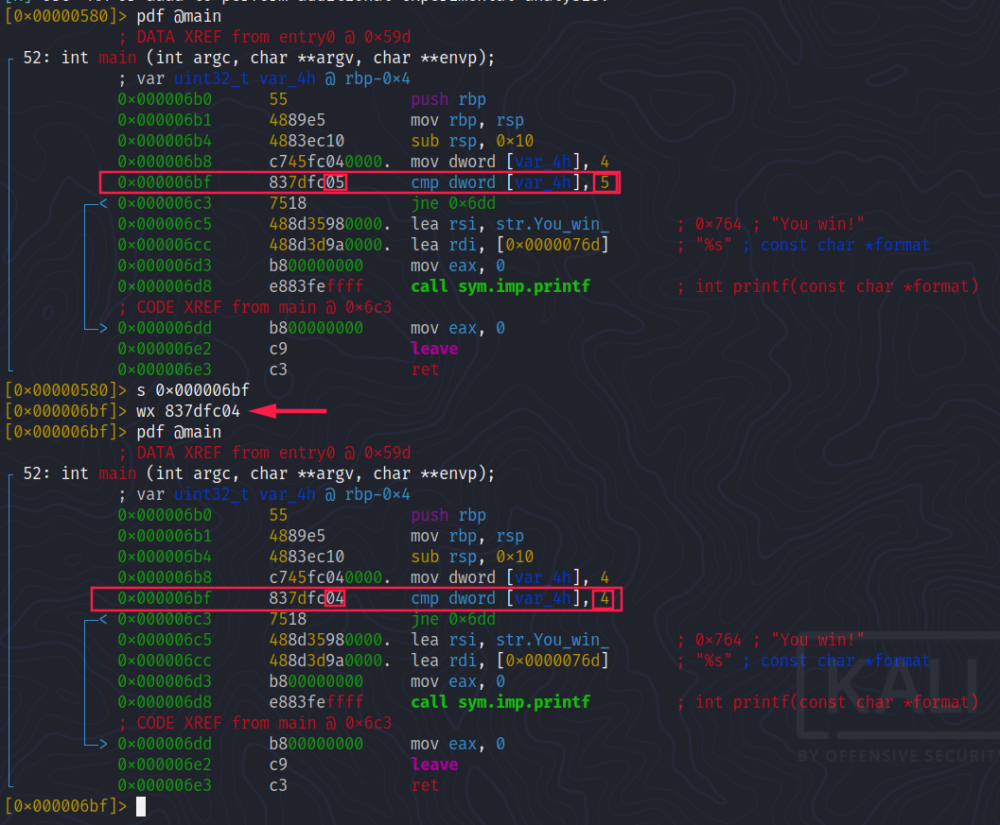
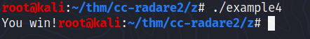
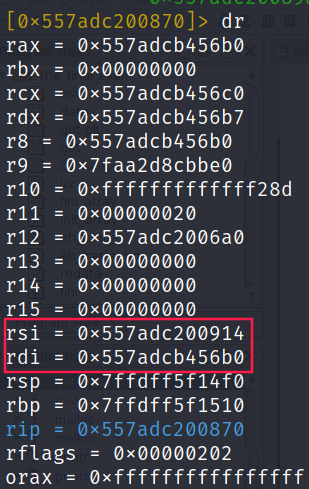
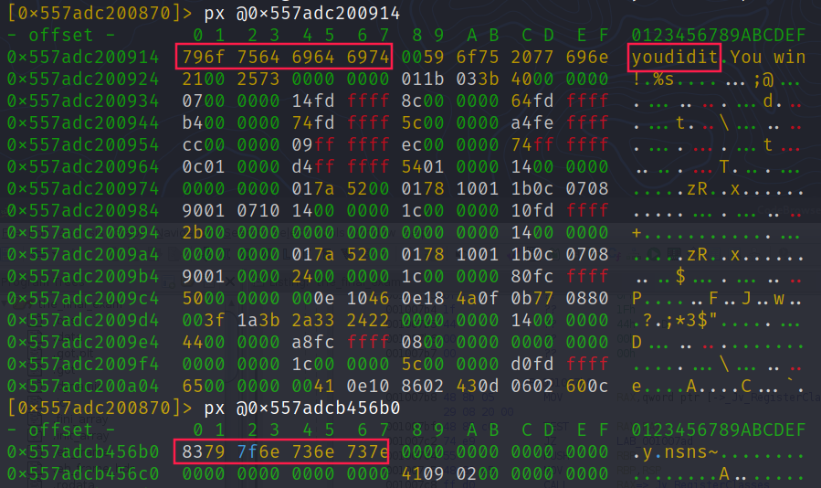
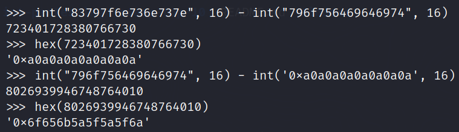
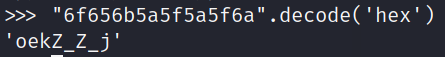
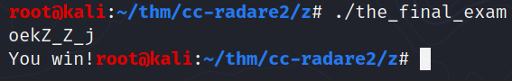

# Crash course `radare2`

`r2 -A` is equivalent to `aaa` command to analyze all referenced code

## Information

- `i` is a command that shows general information of the binary

## Navigating through memory

- `s` is the command that is used to navigate through the memory of your binary. With it and its variations you can you can get information about where you are in the binary as well as move to different points in the binary.

## Printing

- `p` is a command that shows data in a myriad of formats.

## Visual mode

- `s <address>`
- `VV`: enter "graph mode"
    + `s`: step through the binary inside Visual mode
    + `;cmt`: add a comment

## Writing

```
$ r2 -Aw ./example4
[0x00000580]> s 0x000006bf
[0x000006bf]> wx 837dfc04
```





## Final exam


- Set a break point before the comparison:

```
[0x557adc200835]> db 0x557adc200870
```


- Run the binary with "`youdidit`" as input:

```
[0x557adc200835]> dc
youdidit
hit breakpoint at: 0x557adc200870
```

- We analyze `rsi` and `rdi` since they're the arguments of the function `strcmp`:



Let's print their content:



Our input has change and is no longer equal to "`youdidit`". Let's do dome "math" to see the differences:



Finally we find the string that once mutated via the `get_password` pass the test of `strcmp`: 



