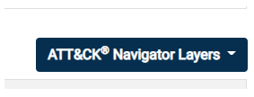
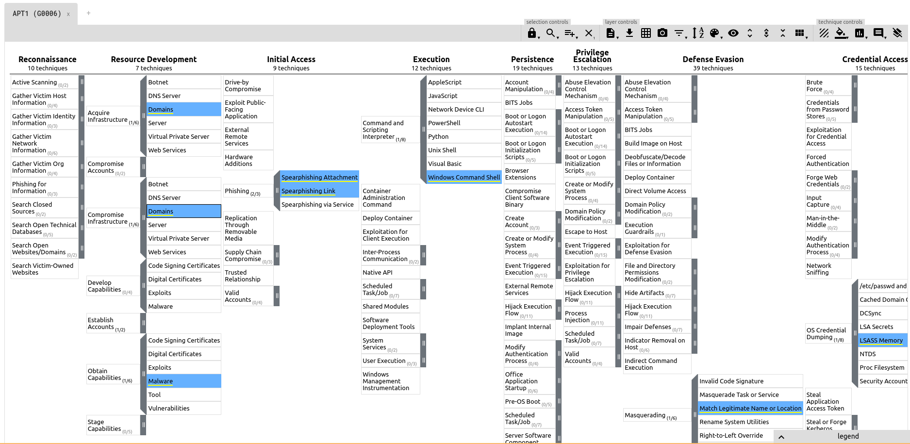

# MITRE

[MITRE](https://www.mitre.org/about/corporate-overview) is a US-based non-profit organization that has contributed a lot to the security community and more specifically with:

- [cve.mitre.org](https://cve.mitre.org/)
- **ATT&CK®** (Adversarial Tactics, Techniques, and Common Knowledge) Framework
- **CAR** (Cyber Analytics Repository) Knowledge Base
- **SHIELD** (sorry, not a fancy acronym) Active Defense
- **AEP** (ATT&CK Emulation Plans)

## Terminology

- **Threat Intelligence**: investigative work (deduce from the victim what type of actor / entity is proceeding - establish a link between the victims - study of cyber attack campaigns trends).

- **APT** (Advanced Persistent Threat): a team/group (**threat group**), or even a country (nation-state group), that engages in long-term attacks against organizations and/or countries.

> The term 'advanced' can be misleading. It does not necessarily mean that they use super-weapon/zero day exploits an so on. Techniques can be quite common and be detected with the right cyberdefense implementation. 

> [FireEye current list of APT Groups](https://www.fireeye.com/current-threats/apt-groups.html)

- **TTP** (Tactics, Techniques, and Procedures): 
    + **Tactic** &rarr; the adversary's goal or objective.
    + **Technique** &rarr; how the adversary achieves the goal or objective.
    + **Procedure** &rarr; how the technique is executed.

## ATT&CK® Framework

_"MITRE ATT&CK® is a globally-accessible knowledge base of adversary tactics and techniques based on real-world observations."_ (<https://attack.mitre.org/>)

The ATT&CK Matrix is a map of known threat groups and their tactics and techniques.

**History**: In 2013, MITRE began to address the need to record and document common **TTPs** that **APT** groups used against enterprise Windows networks. This started with an internal project known as **FMX** (Fort Meade Experiment). Selected security professionals were tasked to emulated adversarial TTPs against a network, and data was collected from the attacks on this network. This helped to construct the beginning pieces of what we know today as the ATT&CK® framework.

Nowadays, ATT&CK® framework has expanded to cover other platforms, such as macOS and Linux.

> This knowledge base can be used by both red and blue team.

When visiting a Group page like [APT1](https://attack.mitre.org/groups/G0006/) for instance, The Navigator Layers button will be available:

Then we can click on it to get more information about the techniques they used:

## CAR Knowledge Base

## Shield Active Defense

## ATT&CK® Emulation Plans