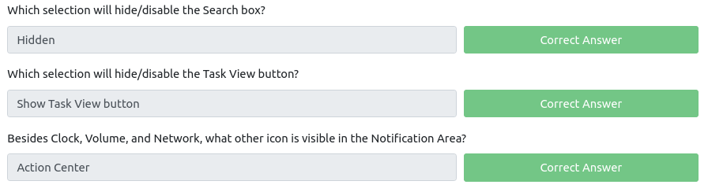
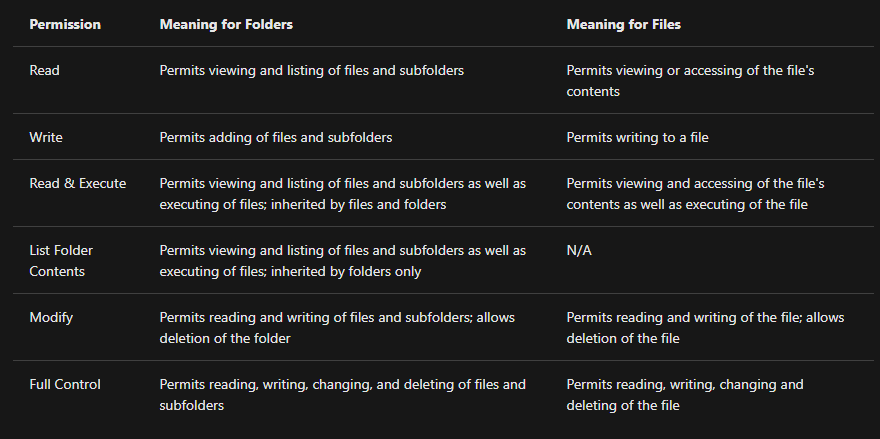

# Windows Fundamentals Part. 1

Windows is the dominant operating system in both home use and corporate networks.

On NTFS volumes, you can set permissions that grant or deny access to files and folders.

The permissions are:

Another feature of NTFS is **Alternate Data Streams** (ADS).

> Alternate Data Streams (ADS) is a file attribute specific to Windows NTFS (New Technology File System).

Every file has at least one data stream (`$DATA`), and ADS allows files to contain more than one stream of data. Natively Window Explorer doesn't display ADS to the user. There are 3rd party executables that can be used to view this data, but Powershell gives you the ability to view ADS for files.

> From a security perspective, malware writers have used ADS to hide data

> Not all its uses are malicious. For example, when you download a file from the Internet, there are identifiers written to ADS to identify that the file was downloaded from the Internet.

- <https://blog.malwarebytes.com/101/2015/07/introduction-to-alternate-data-streams/>

> The system environment variable for the Windows directory is `%windir%`

How does  User Account Control (UAC) work? When a user with an account type of administrator logs into a system, the current session doesn't run with elevated permissions. When an operation requiring higher-level privileges needs to execute, the user will be prompted to confirm if they permit the operation to run. 