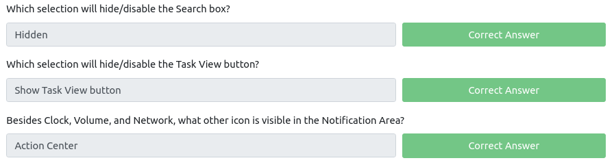
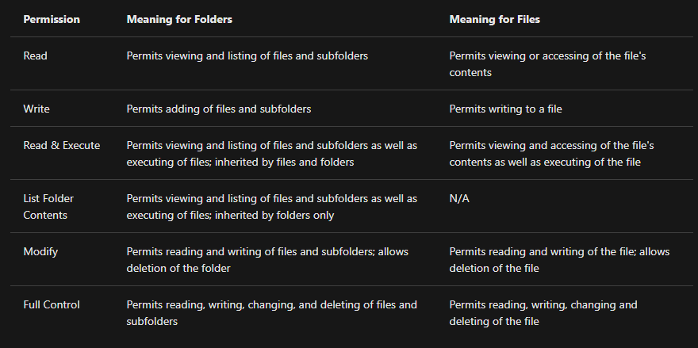

# Windows Fundamentals Part. 1

Windows is the dominant operating system in both home use and corporate networks.

On NTFS volumes, you can set permissions that grant or deny access to files and folders.

The permissions are:

Another feature of NTFS is **Alternate Data Streams** (ADS).

> Alternate Data Streams (ADS) is a file attribute specific to Windows NTFS (New Technology File System).

Every file has at least one data stream (`$DATA`), and ADS allows files to contain more than one stream of data. Natively Window Explorer doesn't display ADS to the user. There are 3rd party executables that can be used to view this data, but Powershell gives you the ability to view ADS for files.

> From a security perspective, malware writers have used ADS to hide data

> Not all its uses are malicious. For example, when you download a file from the Internet, there are identifiers written to ADS to identify that the file was downloaded from the Internet.

- <https://blog.malwarebytes.com/101/2015/07/introduction-to-alternate-data-streams/>

> The system environment variable for the Windows directory is `%windir%`

How does  User Account Control (UAC) work? When a user with an account type of administrator logs into a system, the current session doesn't run with elevated permissions. When an operation requiring higher-level privileges needs to execute, the user will be prompted to confirm if they permit the operation to run. 

# Windows Fundamentals Part. 2

`MSConfig` is for advanced troubleshooting, and its main purpose is to help diagnose startup issues. It requires local Admin rights to open it.

`compmgmt` (**Computer Management**) utility.

<https://docs.microsoft.com/en-us/windows/win32/eventlog/event-types>

<https://docs.microsoft.com/en-us/windows/win32/eventlog/eventlog-key>

> **Note**: The WMIC tool is deprecated in Windows 10, version 21H1. Windows PowerShell supersedes this tool for WMI. 

`msinfo32` &rarr; **System Information**

`resmon` &rarr; **Resource Monitor** 

The **Windows Registry** (per Microsoft) is a central hierarchical database used to store information necessary to configure the system for one or more users, applications, and hardware devices. There are various ways to view/edit the registry. One way is to use the Registry Editor (`regedit`) or `regedt32.exe`

The registry contains information that Windows continually references during operation, such as:

- Profiles for each user
- Applications installed on the computer and the types of documents that each can create
- Property sheet settings for folders and application icons
- What hardware exists on the system
- The ports that are being used.

<https://docs.microsoft.com/en-us/troubleshoot/windows-server/performance/windows-registry-advanced-users>

# Windows Fundamentals Part. 3

**Patch Tuesday**: every 2nd Tuesday of each month, Microsoft provide security updates, feature enhancements, and patches for the Windows operating system and other Microsoft products, such as Microsoft Defender. `control /name Microsoft.WindowsUpdate`

<https://msrc.microsoft.com/update-guide>

The Volume Shadow Copy Service (**VSS**) coordinates the required actions to create a consistent shadow copy (also known as a snapshot or a point-in-time copy) of the data that is to be backed up.

- <https://www.csoonline.com/article/3253899/the-best-new-windows-10-security-features.html>
- <https://docs.microsoft.com/en-us/windows/win32/amsi/antimalware-scan-interface-portal>
- <https://docs.microsoft.com/en-us/windows/security/identity-protection/credential-guard/credential-guard-manage>
- <https://support.microsoft.com/en-us/windows/learn-about-windows-hello-and-set-it-up-dae28983-8242-bb2a-d3d1-87c9d265a5f0#:~:text=Windows%2010,in%20with%20just%20your%20PIN.>
- <https://docs.microsoft.com/en-us/windows/security/information-protection/bitlocker/bitlocker-overview>